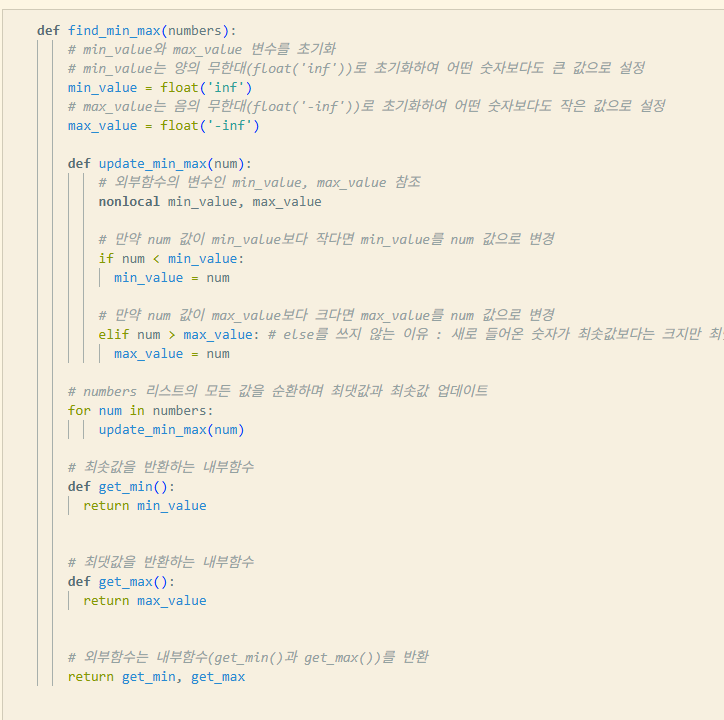
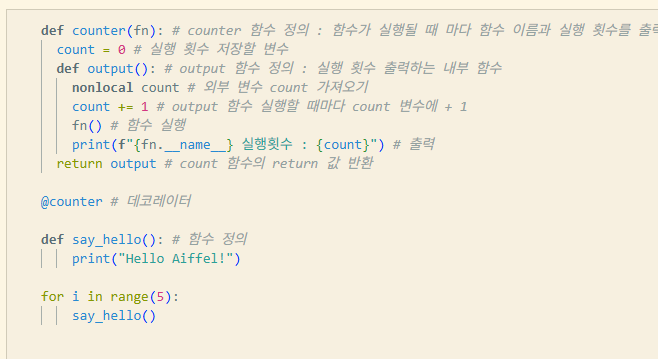

# AIFFEL Campus Online Code Peer Review Templete
- 코더 : 천세문
- 리뷰어 : 이예령


# PRT(Peer Review Template)
- [x]  **1. 주어진 문제를 해결하는 완성된 코드가 제출되었나요?**

        
       

- [x]  **2. 전체 코드에서 가장 핵심적이거나 가장 복잡하고 이해하기 어려운 부분에 작성된 
주석 또는 doc string을 보고 해당 코드가 잘 이해되었나요?**
    - 해당 코드 블럭을 왜 핵심적이라고 생각하는지 확인
    - 해당 코드 블럭에 doc string/annotation이 달려 있는지 확인
    - 해당 코드의 기능, 존재 이유, 작동 원리 등을 기술했는지 확인
    - 주석을 보고 코드 이해가 잘 되었는지 확인
        - 중요! 잘 작성되었다고 생각되는 부분을 캡쳐해 근거로 첨부

    - 이해가 잘 되었다.   


        
- [ ]  **3. 에러가 난 부분을 디버깅하여 문제를 해결한 기록을 남겼거나
새로운 시도 또는 추가 실험을 수행해봤나요?**
    - 문제 원인 및 해결 과정을 잘 기록하였는지 확인
    - 프로젝트 평가 기준에 더해 추가적으로 수행한 나만의 시도, 
    실험이 기록되어 있는지 확인
        - 중요! 잘 작성되었다고 생각되는 부분을 캡쳐해 근거로 첨부  

        - 에러가 발생한 적이 없는 듯 하다. 
        
- [ ]  **4. 회고를 잘 작성했나요?**
    - 주어진 문제를 해결하는 완성된 코드 내지 프로젝트 결과물에 대해
    배운점과 아쉬운점, 느낀점 등이 기록되어 있는지 확인
    - 전체 코드 실행 플로우를 그래프로 그려서 이해를 돕고 있는지 확인
        - 중요! 잘 작성되었다고 생각되는 부분을 캡쳐해 근거로 첨부  

        - 회고가 없었다 
        
- [x]  **5. 코드가 간결하고 효율적인가요?**
    - 파이썬 스타일 가이드 (PEP8) 를 준수하였는지 확인
    - 코드 중복을 최소화하고 범용적으로 사용할 수 있도록 함수화/모듈화했는지 확인
        - 중요! 잘 작성되었다고 생각되는 부분을 캡쳐해 근거로 첨부

    - 모듈화가 굉장히 잘 되었다고 생각했다  


# 회고(참고 링크 및 코드 개선)  

코드가 굉장히 간결하고 모듈화가 잘 되어있어 읽기 쉬우면서도 효율적이었다.
단 현재 작성된 counter 데코레이터는 인자나 반환값이 없는 함수에만 동작하도록 제한되어있다고 한다. 
여기에서는 문제가 없지만 추후 범용성이 높은 데코레이터를 만들 때는 아래와 같이 가변인자를 사용해 본래 함수의 반환값을 전달하도록 하는 것이 좋다고 한다. 


```
def counter_generic(fn):
    count = 0
    # *args, **kwargs를 추가하여 인자가 있는 함수에도 대응
    def output(*args, **kwargs):
        nonlocal count
        count += 1
        # 원래 함수의 리턴값을 받아둠
        result = fn(*args, **kwargs)
        print(f"{fn.__name__} 실행횟수 : {count}")
        # 리턴값을 돌려줌
        return result
    return output

```
