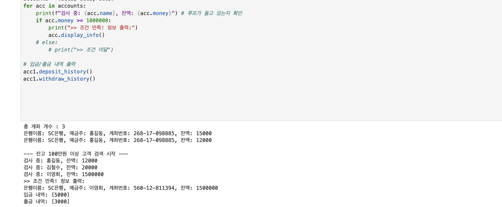
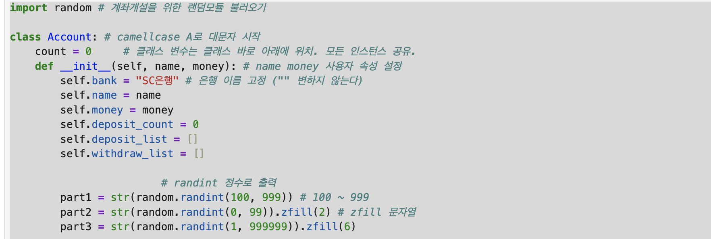
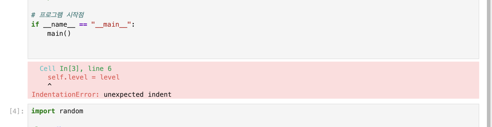

# AIFFEL Campus Online Code Peer Review Templete
- 코더 : 천세문
- 리뷰어 : 강경수


# PRT(Peer Review Template)
- [x]  **1. 주어진 문제를 해결하는 완성된 코드가 제출되었나요?**
    - 문제에서 요구하는 최종 결과물이 첨부되었는지 확인
        - 중요! 해당 조건을 만족하는 부분을 캡쳐해 근거로 첨부

>주어진 요구사항에 맞게 계좌 생성, 입출금, 거래내역 조회 기능이 구현되었으며 실행 결과도 정상적으로 확인되었다.
    
- [x]  **2. 전체 코드에서 가장 핵심적이거나 가장 복잡하고 이해하기 어려운 부분에 작성된 
주석 또는 doc string을 보고 해당 코드가 잘 이해되었나요?**
    - 해당 코드 블럭을 왜 핵심적이라고 생각하는지 확인
    - 해당 코드 블럭에 doc string/annotation이 달려 있는지 확인
    - 해당 코드의 기능, 존재 이유, 작동 원리 등을 기술했는지 확인
    - 주석을 보고 코드 이해가 잘 되었는지 확인
        - 중요! 잘 작성되었다고 생각되는 부분을 캡쳐해 근거로 첨부

>주요 변수와 클래스 변수의 역할에 대한 설명이 작성되어 있어 코드 흐름을 이해하는 데 도움이 되었다.
        
- [x]  **3. 에러가 난 부분을 디버깅하여 문제를 해결한 기록을 남겼거나
새로운 시도 또는 추가 실험을 수행해봤나요?**
    - 문제 원인 및 해결 과정을 잘 기록하였는지 확인
    - 프로젝트 평가 기준에 더해 추가적으로 수행한 나만의 시도, 
    실험이 기록되어 있는지 확인
        - 중요! 잘 작성되었다고 생각되는 부분을 캡쳐해 근거로 첨부

>디버깅 관련 부분은 일부 존재하지만, 문제 해결 과정과 결과가 구체적으로 기록되어 있지는 않았다.
        
- [x]  **4. 회고를 잘 작성했나요?**
    - 주어진 문제를 해결하는 완성된 코드 내지 프로젝트 결과물에 대해
    배운점과 아쉬운점, 느낀점 등이 기록되어 있는지 확인
    - 전체 코드 실행 플로우를 그래프로 그려서 이해를 돕고 있는지 확인
        - 중요! 잘 작성되었다고 생각되는 부분을 캡쳐해 근거로 첨부

>페어 코딩을 하며 느낀점을 회고로 간단히 작성하였다.
        
- [x]  **5. 코드가 간결하고 효율적인가요?**
    - 파이썬 스타일 가이드 (PEP8) 를 준수하였는지 확인
    - 코드 중복을 최소화하고 범용적으로 사용할 수 있도록 함수화/모듈화했는지 확인
        - 중요! 잘 작성되었다고 생각되는 부분을 캡쳐해 근거로 첨부

>배운 부분들을 활용하여 기능 구현이 잘되었다.


# 회고(참고 링크 및 코드 개선)
```
# 리뷰어의 회고를 작성합니다.
# 코드 리뷰 시 참고한 링크가 있다면 링크와 간략한 설명을 첨부합니다.
# 코드 리뷰를 통해 개선한 코드가 있다면 코드와 간략한 설명을 첨부합니다.
```  
>코드 전반적으로 요구사항을 충실히 구현하였으며, 클래스와 메서드를 활용하여 기능을 분리한 점이 좋았다.
>
>변수와 클래스 변수에 대한 설명 주석이 있어 코드 이해에 도움이 되었다.
>
>디버깅용 출력문과 주석은 최종 제출 시 제거하면 가독성이 더 좋아질 것으로 보이며, 회고 및 문제 해결 과정에 대한 기록이 추가된다면 더 좋을 것 같다.
