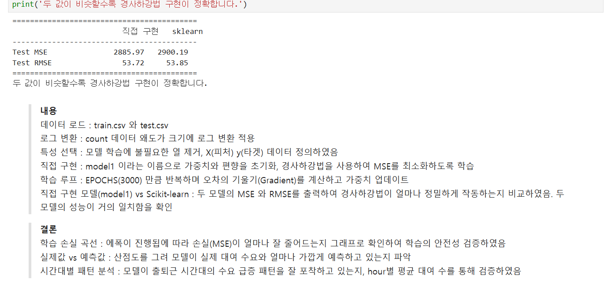
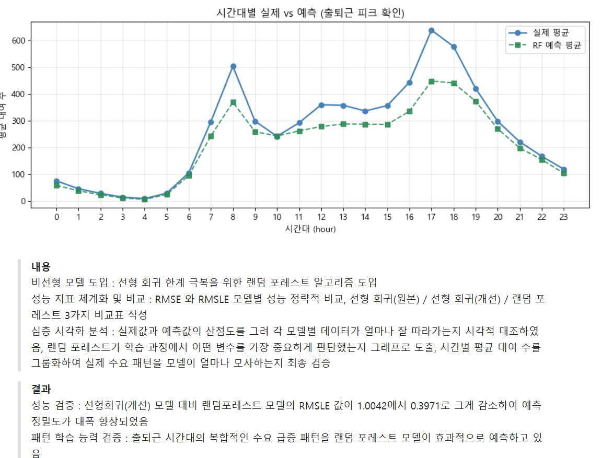
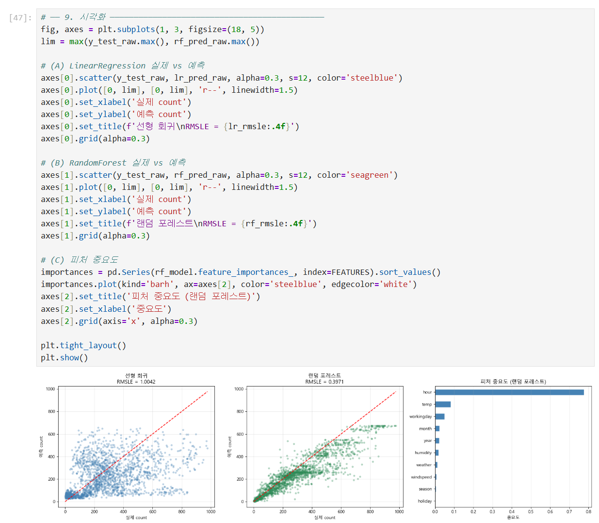
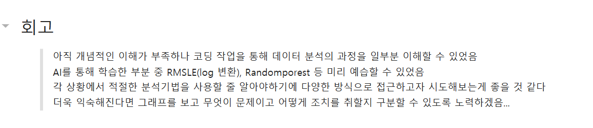

# AIFFEL Campus Online Code Peer Review Templete
- 코더 : 천세문  
- 리뷰어 : 임성배  

# PRT(Peer Review Template)
- [X]  **1. 주어진 문제를 해결하는 완성된 코드가 제출되었나요?**
    - 문제 해결 코드와 그 결과물이 제출된 것을 확인하였습니다
        
         
- [X]  **2. 전체 코드에서 가장 핵심적이거나 가장 복잡하고 이해하기 어려운 부분에 작성된 
주석 또는 doc string을 보고 해당 코드가 잘 이해되었나요?**
    - 노드에 있는 코드를 그대로 사용하지 않고, 이해하기 쉽고 알아보기 편하게 코딩하여 결과물을 더 편하게 확인할 수 있게 코딩한 부분이 인상깊었습니다.  
    - 퀘스트의 마지막에 어떻게 코딩하였는지 내용과 결과 설명을 추가하여 과정을 이해할 수 있게 퀘스트를 진행하였습니다. 
        
        
- [X]  **3. 에러가 난 부분을 디버깅하여 문제를 해결한 기록을 남겼거나
새로운 시도 또는 추가 실험을 수행해봤나요?**
    - 문제 원인 및 해결 과정을 잘 기록하였는지 확인
    - 다양한 방식으로 시각화 할 수 있게 추가적인 시도를 한 점이 무척 인상적이었습니다 
       
        
- [X]  **4. 회고를 잘 작성했나요?**
    - 회고가 매우 잘 작성되어 있었고, 퀘스트 진행 복기 및 향후 스탭 등을 잘 작성해주셨습니다. 
      
        
- [X]  **5. 코드가 간결하고 효율적인가요?**
    - 불필요한 부분 없이 간결하고 깔끔하게 잘 코딩되어 있었습니다.  


# 회고(참고 링크 및 코드 개선)
```
# 리뷰어의 회고를 작성합니다.
# 코드 리뷰 시 참고한 링크가 있다면 링크와 간략한 설명을 첨부합니다.
# 코드 리뷰를 통해 개선한 코드가 있다면 코드와 간략한 설명을 첨부합니다.
```

퀘스트 코드를 복붙하여 과제를 한 입장에서 볼 때, 그대로 코드를 가져다 쓰지 않고 하나라도 다르게, 더 편하게 결과물을 내기 위해 고민하고 새로운 시도를 한 점이 무척 인상깊었고, 자신을 돌아보게 되었습니다.  
코딩 뿐 아니라 진행 과정과 결과에 대해서도 자세히 기재하여 처음 보는 사람이라도 쉽게 이해할 수 있도록 깔끔하게 정리해주어서 많은 참고가 되었습니다.  