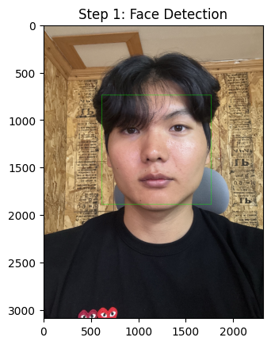
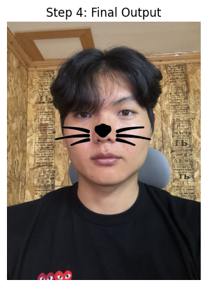
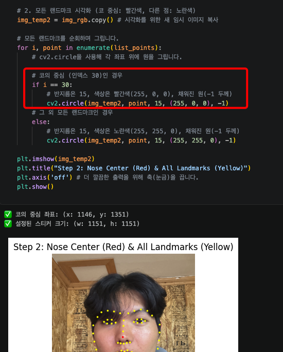
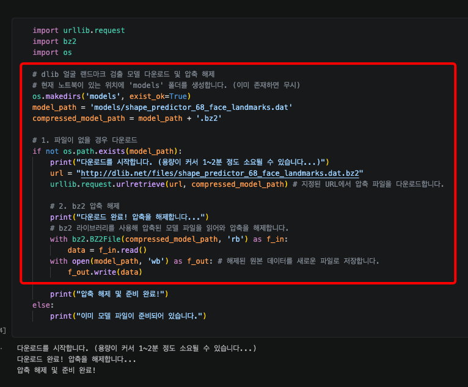
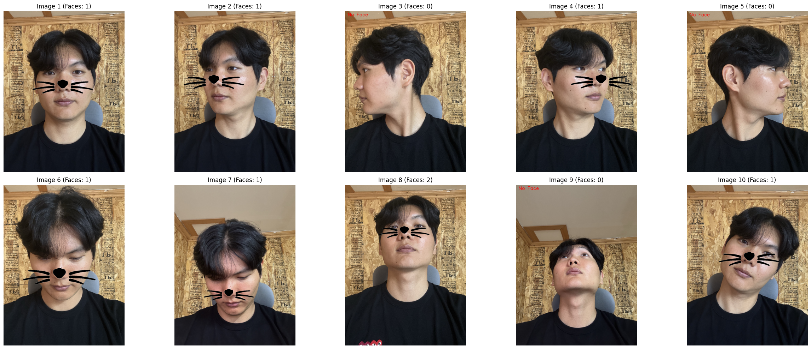
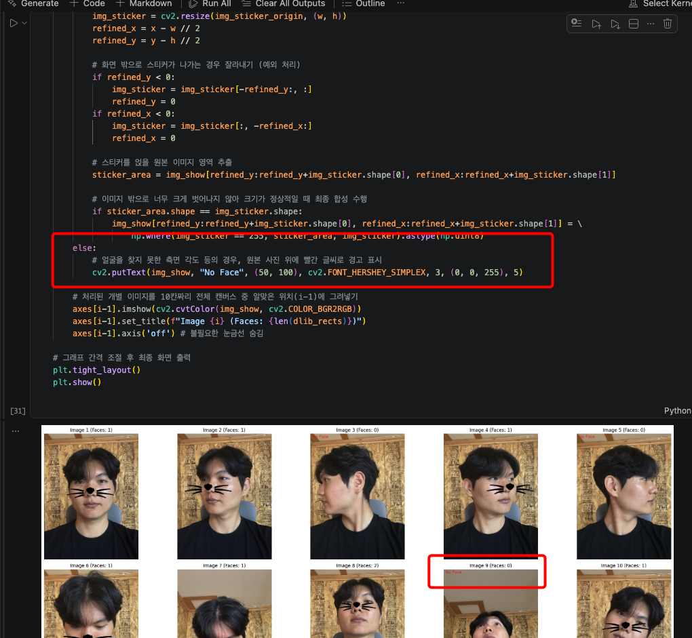
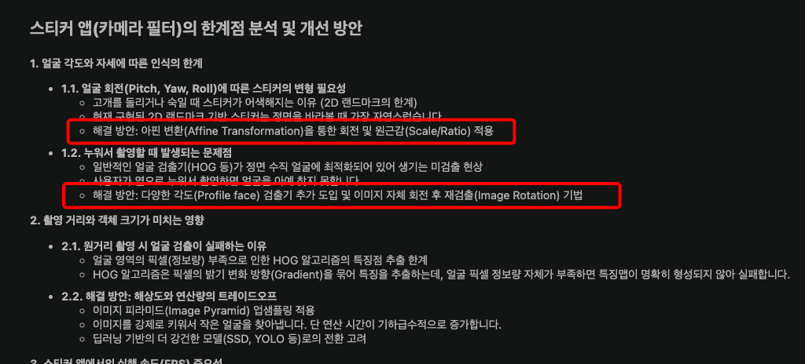
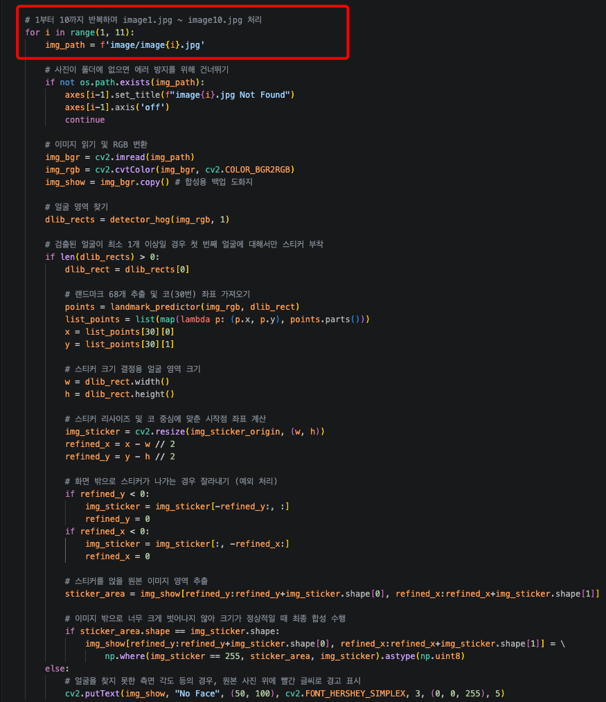
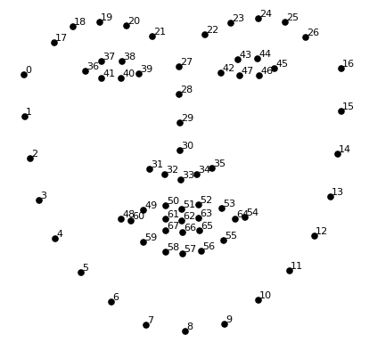

# AIFFEL Campus Online Code Peer Review Templete
- 코더 : 천세문 님
- 리뷰어 : 김민욱


# PRT(Peer Review Template)
- [x]  **1. 주어진 문제를 해결하는 완성된 코드가 제출되었나요?**
    - 얼굴 검출 -> 68개 랜드마크 추출 -> 코(30번) 중심에 고양이 수염 합성까지 전체 파이프라인이 빠짐없이 구성돼 있더라구요. (저는 직접 실행하진 않고, 노트북에 저장된 출력과 코드를 읽으며 확인했습니다.)  
    - 셀 4에서 HOG 검출기로 얼굴 박스를 먼저 찾고("찾은 얼굴 개수: 1개"), 셀 7에서 최종 합성 결과물까지 출력으로 남겨두셔서 완성된 결과물인 게 확실하게 보였습니다.  
      
    

- [x]  **2. 전체 코드에서 가장 핵심적이거나 가장 복잡하고 이해하기 어려운 부분에 작성된 주석 또는 doc string을 보고 해당 코드가 잘 이해되었나요?**
    - 저는 셀 7의 `np.where(img_sticker == 255, sticker_area, img_sticker)` 부분이 제일 핵심이자 헷갈리는 데라고 생각했어요. 스티커에는 알파(투명) 채널이 없으니까, 흰색(255)인 배경 픽셀은 원래 얼굴을 그대로 두고 수염 픽셀만 덮어쓰는 트릭이잖아요.  
    - 이 부분에 "스티커의 배경(흰색)이 있는 픽셀은 원래 얼굴 이미지를 유지하고, 수염이 그려진 나머지 픽셀에만 스티커를 덮어 씌우는 트릭"이라고 주석을 달아두셔서, 왜 `==255` 조건을 쓰는지 바로 이해됐습니다.  
    - 셀 5에서 코 중심을 잡을 때 "68개 랜드마크 중 30번 인덱스가 코의 중심"이라고 인덱스 의미까지 적어주신 것도 따라가기 좋았어요.  
    
    - 셀 1의 모델 준비 부분도, bz2 압축을 읽어서 풀고 새 파일로 저장하는 흐름에 단계별 주석을 달아두셔서 "왜 .bz2를 받아 풀어 쓰는지"가 한눈에 들어왔습니다.  
    

- [x]  **3. 에러가 난 부분을 디버깅하여 문제를 해결한 기록을 남겼거나 새로운 시도 또는 추가 실험을 수행해봤나요?**
    - 셀 8에서 사진 한 장이 아니라 10장(`image1.jpg`~`image10.jpg`)을 한 번에 돌려서 정면/측면/누운 각도/원거리까지 비교하신 게 좋은 추가 실험이라고 봤습니다.  
      
    - 얼굴을 못 찾은 경우 `cv2.putText`로 "No Face"를 띄우고, `sticker_area.shape == img_sticker.shape` 조건으로 스티커가 화면 밖으로 너무 나간 경우를 걸러서 에러 없이 넘어가게 한 예외 처리도 꼼꼼했어요. 실제로 측면 얼굴은 검출이 안 되는 게 결과 그리드에서 그대로 보여서 한계까지 같이 확인됐습니다.  
      

- [x]  **4. 회고를 잘 작성했나요?**
    - 셀 9 마크다운에 한계점 분석과 개선 방안을 5개 주제(각도/거리/FPS/랜드마크 정확도/종합 결론)로 정리하셨는데, 특히 2D 랜드마크의 회전 한계 -> 아핀 변환, Jittering -> 칼만 필터/이동 평균 같은 구체적인 해결책까지 적어주셔서 배울 게 많았습니다.  
    - 분석 내용이 아주 충실합니다!  
    

- [x]  **5. 코드가 간결하고 효율적인가요?**
    - 변수명(`refined_x`, `dlib_rects`)이 직관적이고, 단계마다 `plt.title`로 "Step 1~4"를 붙여두셔서 흐름 읽기가 편했습니다.  
    - 셀 8에서는 단일 이미지 로직을 `for` 루프로 묶어 10장을 한 번에 처리하신 점이 효율적이었어요.  
        
    - 셀 1에서 모델 파일이 이미 있으면 다시 받지 않도록 `if not os.path.exists(model_path)`로 감싸두신 점도 좋았습니다.  
      용량 큰 68 랜드마크 모델을 매번 새로 내려받지 않게 해둬서 다시 실행할 때 시간을 아낄 수 있는 구조라 좋았고, 압축 해제까지 한 번에 처리하셔서 깔끔했어요.  
    - 거의 모든 줄에 친절한 한글 주석이 달려 있어서, 처음 보는 사람도 코드만 따라 읽어도 흐름이 이해되게 짜신 게 가장 큰 장점이라고 느꼈습니다.


# 회고(참고 링크 및 코드 개선)
```
[리뷰어 회고 - 김민욱]
- np.where로 흰 배경을 마스킹하는 합성 트릭을 잘 배웠다.
  알파 채널이 없는 PNG도 == 255 조건으로 배경을 골라내면 합성이 된다는 점.
- 코 중심을 30번 랜드마크로 잡고, 얼굴 박스의 width/height로 스티커 크기를 맞추는
  비례 방식이 깔끔해서 내 코드에도 참고하고 싶었다.

[코드를 보며 특히 좋았던 점]
- 단계마다 중간 결과를 plt.imshow로 그려서 보여주신 덕분에,
  얼굴 박스 -> 랜드마크 68점 -> 리사이즈된 스티커 -> 최종 합성 순서로
  어디서 무슨 일이 일어나는지 눈으로 따라가며 이해할 수 있었다.
- 모델 다운로드/압축 해제, 버전 출력 확인, 화면 밖 예외 처리, 얼굴 미검출 시 "No Face" 표시까지
  챙기셔서 다른 사람이 그대로 내려받아 돌려도 잘 되게 만든 점이 꼼꼼하다고 느꼈다.
- detector_hog(img_rgb, 1)의 두 번째 인자 1(업샘플링)이 작은 얼굴 검출에 쓰인다는 것도
  주석으로 짚어주셔서, 검출이 안 될 때 어디를 손봐야 하는지 힌트까지 얻었다.
```

**참고 링크**  
- dlib 68 face landmarks 인덱스 그림: [researchgate 그림 링크](https://www.researchgate.net/figure/The-68-facial-landmarks-detected-by-the-dlib-library_fig2_329392737)  
  (30번이 코끝이라는 걸 그림으로 확인하기 좋아서 첨부합니다.)  

