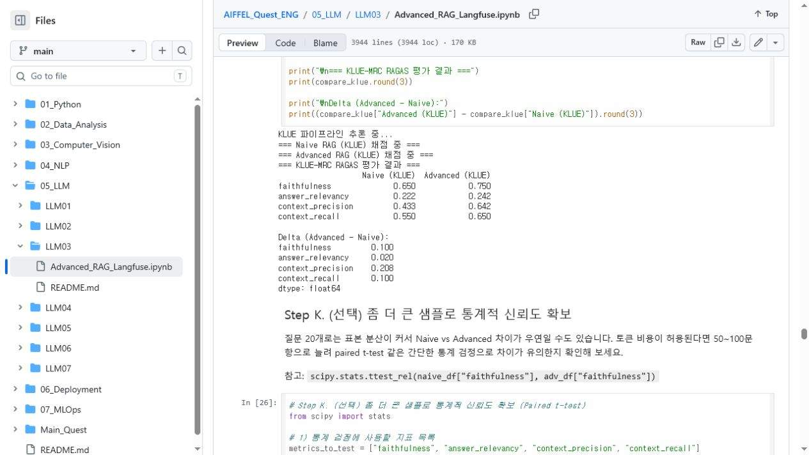
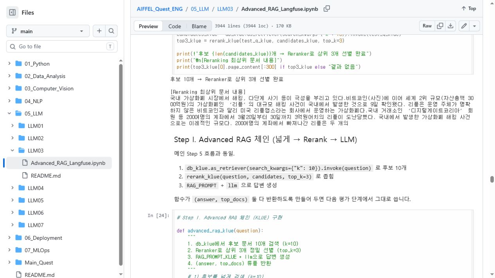
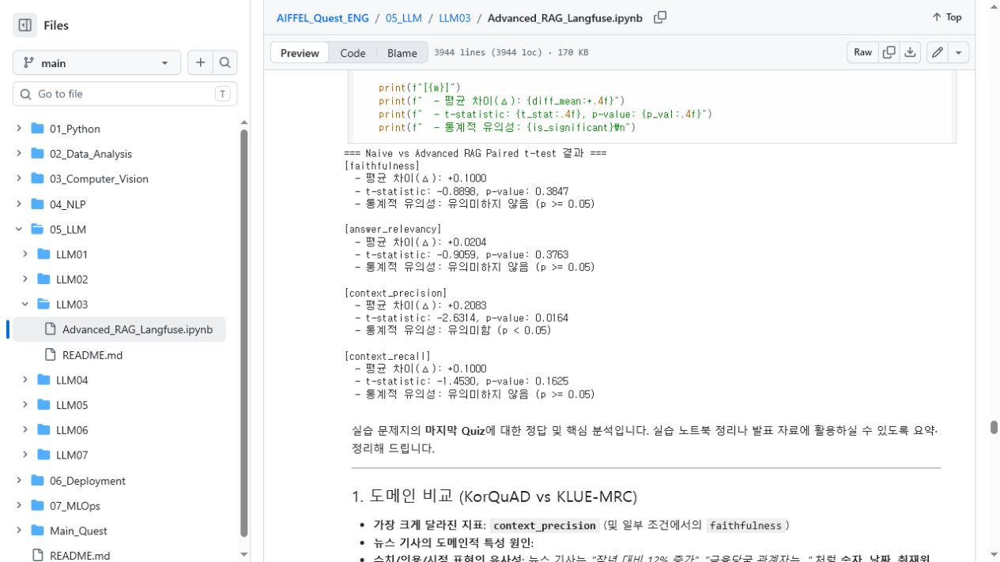
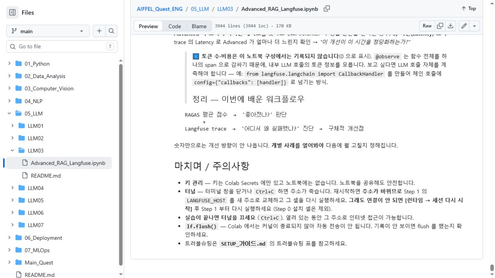
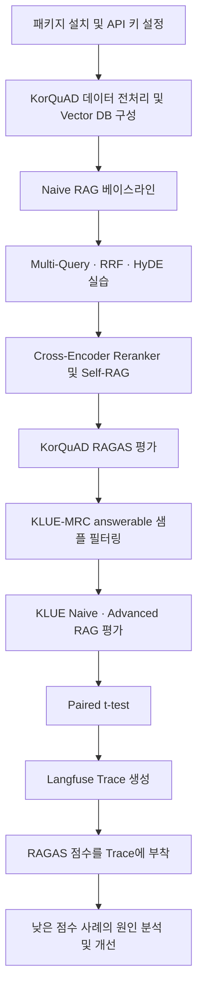
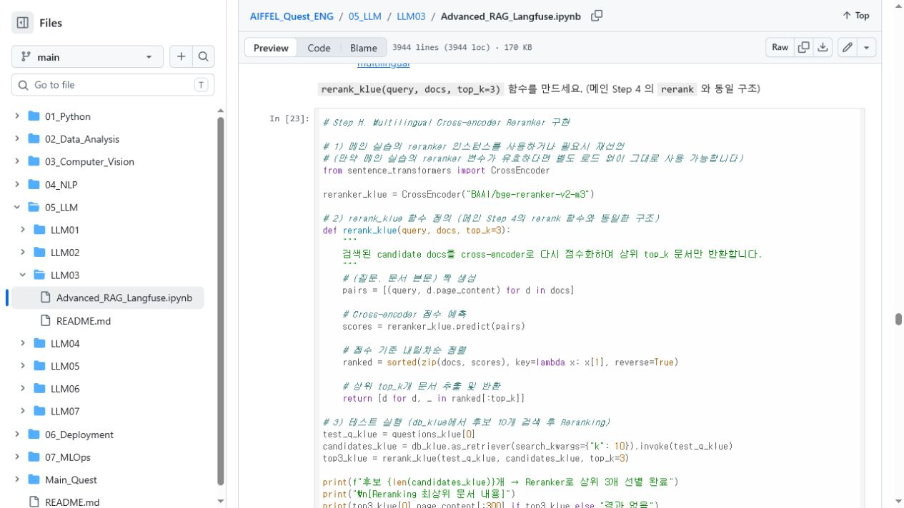

# AIFFEL Campus Online Code Peer Review Template

- 코더: 천세문
- 리뷰어: 김수경
- 리뷰 대상: [Advanced_RAG_Langfuse.ipynb](https://github.com/1003-pro-official/AIFFEL_Quest_ENG/blob/main/05_LLM/LLM03/Advanced_RAG_Langfuse.ipynb)

## PRT(Peer Review Template)

### 1. 주어진 문제를 해결하는 완성된 코드가 제출되었나요?

**평가: 대체로 충족했습니다.**

Naive RAG 구축부터 Multi-Query, RAG-Fusion, HyDE, Cross-Encoder Reranker, Self-RAG, RAGAS 평가, KLUE-MRC 추가 실험, Langfuse 관측까지 과제에서 요구하는 주요 단계가 모두 노트북에 포함되어 있습니다.

특히 KLUE-MRC 평가에서는 `is_impossible=True` 샘플을 제거하고 동일한 20개 질문에 대해 Naive/Advanced 결과를 생성한 뒤, RAGAS의 네 가지 지표를 출력했습니다. 저장된 실행 결과에서는 Advanced 파이프라인이 Naive 파이프라인보다 다음과 같이 개선되었습니다.

- Faithfulness: `0.650 → 0.750`
- Answer Relevancy: `0.222 → 0.242`
- Context Precision: `0.433 → 0.642`
- Context Recall: `0.550 → 0.650`

다만 Part 5의 Langfuse 코드는 새로운 런타임에서 처음부터 재실행할 때 필요한 초기화 코드와 Reranker 반환 형식을 한 번 더 점검할 필요가 있습니다. 이에 대한 개선안은 아래의 `회고(참고 링크 및 코드 개선)`에 작성했습니다.



---

### 2. 핵심적이거나 복잡한 부분의 주석 또는 docstring을 보고 코드를 잘 이해할 수 있었나요?

**평가: 충족했습니다.**

가장 핵심적인 부분은 KLUE-MRC용 `advanced_rag_klue()` 함수입니다. 검색 후보 10개를 가져온 후 Reranker로 상위 3개를 선별하고, 선택된 문서를 LLM 프롬프트에 전달하는 전체 흐름을 하나의 함수로 묶고 있습니다. 이후 RAGAS 평가에서도 `(answer, top_docs)` 반환값을 그대로 사용할 수 있어 파이프라인의 중심 역할을 합니다.

해당 함수의 docstring에는 다음 네 단계가 순서대로 기술되어 있습니다.

1. `db_klue`에서 후보 문서 10개 검색
2. Reranker로 상위 3개 정밀 선별
3. `RAG_PROMPT_KLUE`와 LLM을 이용한 답변 생성
4. `(answer, top_docs)` 반환

각 단계마다 주석과 번호가 있어 코드의 존재 이유와 데이터 흐름을 이해하기 쉬웠습니다. 특히 답변뿐 아니라 검색 문서도 함께 반환하도록 설계하여 이후 평가 코드와 자연스럽게 연결한 점이 좋았습니다.



---

### 3. 디버깅 기록, 새로운 시도 또는 추가 실험을 수행했나요?

**평가: 충족했습니다.**

다음과 같은 문제 대응과 추가 실험이 확인되었습니다.

- 라이브러리 충돌을 줄이기 위해 RAGAS, LangChain, Langfuse 버전을 명시적으로 고정했습니다.
- 설치 후 런타임 재시작이 필요하다는 안내를 별도로 작성했습니다.
- OpenAI Embedding 요청의 토큰 한도를 피하기 위해 문서를 100개씩 배치 적재했습니다.
- KLUE-MRC의 `is_impossible=True` 데이터를 평가에서 제외했습니다.
- KorQuAD뿐 아니라 뉴스 도메인의 KLUE-MRC로 파이프라인을 확장했습니다.
- 20개 질문의 평균값만 비교하지 않고 `scipy.stats.ttest_rel()`을 이용한 대응표본 t-test를 추가했습니다.
- Langfuse에 검색 문서, Reranker 점수, RAGAS 점수를 기록하여 실패 사례를 추적하는 실험을 추가했습니다.

통계 검정 결과에서는 `context_precision`의 평균 개선폭이 `+0.2083`, p-value가 `0.0164`로 나타나 네 지표 중 유일하게 유의수준 0.05에서 통계적으로 유의한 차이를 보였습니다. 단순 평균 비교에서 끝나지 않고 결과가 우연일 가능성까지 확인한 시도가 인상적이었습니다.



추가로, 출력에 남아 있는 ChromaDB/PostHog telemetry 오류 메시지의 원인과 처리 과정을 짧게 기록하면 디버깅 흔적이 더욱 명확해질 것 같습니다.

---

### 4. 회고를 잘 작성했나요?

**평가: 부분 충족했습니다.**

마지막 부분에 다음과 같은 실무적 학습 내용이 잘 정리되어 있습니다.

- RAGAS 평균 점수로 전체 성능 개선 여부 확인
- Langfuse trace로 실패한 개별 질문의 원인 확인
- 검색 실패와 생성 실패를 구분하여 개선 방향 설정
- API 키, Cloudflare 터널, `lf.flush()`와 관련된 실행 주의사항

즉, 단순히 점수를 제시하는 데서 끝나지 않고 `평가 → 실패 사례 추적 → 개선점 도출`이라는 워크플로를 정리한 점이 좋았습니다.

다만 개인적인 관점의 **배운 점, 아쉬운 점, 어려웠던 점, 다음에 개선하고 싶은 점**은 상대적으로 적습니다. 마지막에 이러한 내용을 3~4문장 정도 추가하면 더 완성도 높은 회고가 될 것 같습니다.



노트북 전체 실행 흐름을 정리하면 다음과 같습니다.



---

### 5. 코드가 간결하고 효율적인가요?

**평가: 대체로 충족했습니다.**

다음 기능이 함수로 분리되어 있어 각 구성 요소를 독립적으로 테스트하거나 재사용하기 좋습니다.

- `fan_out_queries()`
- `reciprocal_rank_fusion()`
- `hyde_retrieve()` / `hyde_retrieve_klue()`
- `rerank()` / `rerank_klue()`
- `advanced_rag()` / `advanced_rag_klue()`
- `make_dataset()` / `make_dataset_klue()`
- `push_scores()`

특히 `rerank_klue()`는 질문과 문서의 pair 생성, Cross-Encoder 점수 계산, 내림차순 정렬, 상위 문서 반환을 하나의 함수로 분리해 역할이 명확합니다.



개선할 부분도 있습니다.

- 들여쓰기를 PEP 8 권장사항인 공백 4칸으로 통일하면 가독성이 좋아집니다.
- 일부 코드가 한 줄에 길게 작성되어 있으므로 괄호를 이용해 여러 줄로 나누는 것이 좋습니다.
- KorQuAD와 KLUE에서 유사한 함수가 반복되므로 `vectorstore`, `prompt`, `reranker`를 인자로 받는 공통 함수로 일반화할 수 있습니다.
- `context_docs`, `EVAL_N`, `questions` 등의 변수를 도메인별 이름으로 구분하면 셀을 선택적으로 재실행할 때 혼동을 줄일 수 있습니다.
- `db`와 `db_klue`에 서로 다른 `collection_name`을 명시하면 두 데이터셋의 Vector DB를 더 확실하게 분리할 수 있습니다.

---

## 회고(참고 링크 및 코드 개선)

### 리뷰어의 회고

이번 코드 리뷰를 통해 단순한 RAG 구현에서 끝나지 않고, RAGAS로 성능을 정량화하고 Langfuse로 개별 실패 원인을 추적하는 전체 흐름을 학습할 수 있었습니다. 특히 검색 성능을 `context_precision`과 `context_recall`로 나누어 해석하고, 평균 차이를 t-test로 검증한 구성이 인상적이었습니다.

또한 Jupyter Notebook은 저장된 출력이 존재하더라도 현재 코드가 새로운 런타임에서 동일하게 실행되는지 확인하는 것이 중요하다는 점을 다시 확인했습니다. 마지막 제출 전에는 `런타임 다시 시작 → 전체 셀 실행`을 수행하여 모든 변수와 출력이 현재 코드와 일치하는지 검증하면 좋겠습니다.

### 코드 개선 제안

Part 5에서는 `observe`, `propagate_attributes`, `lf`의 초기화가 필요합니다. 또한 기존 `rerank()` 함수는 `Document` 목록을 반환하지만 `run_advanced()`에서는 `(Document, score)` 튜플을 기대하고 있습니다. 점수까지 Langfuse metadata에 기록하려면 별도의 `rerank_with_scores()` 함수로 분리하는 것이 안전합니다.

```python
import os
from langfuse import get_client, observe, propagate_attributes

# 자신의 Langfuse 또는 Cloudflare 터널 주소로 교체합니다.
os.environ["LANGFUSE_BASE_URL"] = "https://<YOUR-LANGFUSE-URL>"
lf = get_client()


def rerank_with_scores(query, docs, top_k=3):
    """문서를 관련도 순으로 재정렬하고 (Document, score)를 반환합니다."""
    if not docs:
        return []

    pairs = [(query, doc.page_content) for doc in docs]
    scores = reranker.predict(pairs)
    ranked = sorted(
        zip(docs, scores),
        key=lambda item: item[1],
        reverse=True,
    )
    return ranked[:top_k]


@observe(name="advanced_rag", capture_input=False, capture_output=False)
def run_advanced(question, reference=None):
    candidates = db.as_retriever(
        search_kwargs={"k": 10}
    ).invoke(question)

    ranked = rerank_with_scores(question, candidates, top_k=3)
    top_docs = [doc for doc, _ in ranked]
    top_scores = [float(score) for _, score in ranked]

    answer = (RAG_PROMPT | llm | StrOutputParser()).invoke({
        "context": format_docs(top_docs),
        "question": question,
    })

    lf.update_current_span(
        input=question,
        output=answer,
        metadata={
            "pipeline": "advanced",
            "reference": reference,
            "retrieved_contexts": [doc.page_content for doc in top_docs],
            "reranker_top_scores": top_scores,
            "n_candidates": len(candidates),
        },
    )

    return answer, [doc.page_content for doc in top_docs], lf.get_current_trace_id()
```

### 참고 링크

- [Langfuse Python SDK 관측 방법](https://langfuse.com/docs/observability/sdk/instrumentation): `observe`, trace ID, span 업데이트 방법 참고
- [RAGAS 공식 문서](https://docs.ragas.io/en/stable/): RAGAS 평가 데이터 구조와 지표 참고
- [SciPy `ttest_rel`](https://docs.scipy.org/doc/scipy/reference/generated/scipy.stats.ttest_rel.html): 대응표본 t-test 사용법 참고
- [PEP 8](https://peps.python.org/pep-0008/): 들여쓰기, 줄 길이, 함수 및 변수 작성 스타일 참고


학습할수있게 LLM의 분석으로 작성하였습니다.
