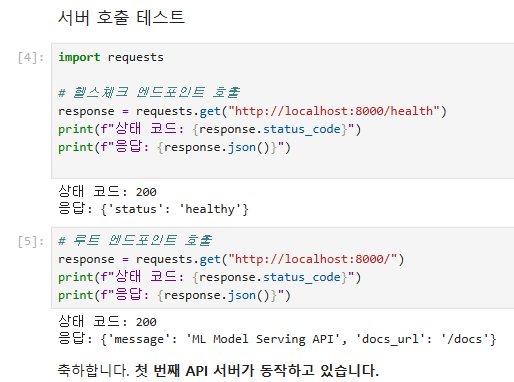
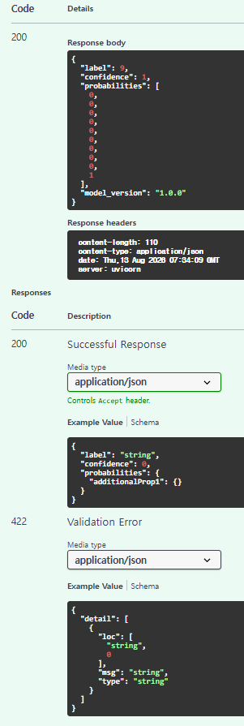

## 제출

### 1. 섹션 1.5 수행내역 캡쳐 

      

### 2. 섹션 2, 3 셀 출력
---

### 섹션 2: 첫 번째 엔드포인트 만들기 (Path, Query, Body)

#### `app/__init__.py` 생성 
* **코드 내용**: `os.makedirs("app", exist_ok=True); with open("app/__init__.py", "w") as f: pass`
* **실행 출력**:
  ```text
  ✅ app/__init__.py 생성 완료
  ```

#### `main_params.py` 파일 생성 - Path 파라미터 엔드포인트
* **코드 내용**: `%%writefile app/main_params.py`
* **실행 출력**:
  ```text
  Overwriting app/main_params.py
  ```

#### Path 파라미터 호출 테스트
* **코드 내용**: `GET /models/sentiment-v1`, `GET /models/image-classifier`
* **실행 출력**:
  ```python
  {'model_name': 'sentiment-v1', 'status': 'running', 'version': '1.0.0'}
  {'model_name': 'image-classifier', 'status': 'running', 'version': '1.0.0'}
  ```

#### Path 파라미터 정상 및 타입 오류 테스트
* **코드 내용**: `GET /predictions/42` (정상), `GET /predictions/abc` (타입 오류)
* **실행 출력**:
  ```python
  상태: 200, 응답: {'prediction_id': 42, 'label': '긍정', 'confidence': 0.92}
  상태: 422
  에러: {'detail': [{'type': 'int_parsing', 'loc': ['path', 'prediction_id'], 'msg': 'Input should be a valid integer, unable to parse string as an integer', 'input': 'abc'}]}
  ```

#### Query 파라미터 호출 테스트 (Cell 90)
* **코드 내용**: `/models`, `/models?status=running`, `/models?status=running&limit=1`
* **실행 출력**:
  ```python
  전체 모델: {'total': 3, 'models': [{'name': 'sentiment-v1', 'status': 'running'}, {'name': 'image-clf-v2', 'status': 'running'}, {'name': 'ner-v1', 'status': 'stopped'}]}
  running만: {'total': 2, 'models': [{'name': 'sentiment-v1', 'status': 'running'}, {'name': 'image-clf-v2', 'status': 'running'}]}
  running, 1개만: {'total': 1, 'models': [{'name': 'sentiment-v1', 'status': 'running'}]}
  ```

#### Request Body POST 호출 테스트
* **코드 내용**: `POST /predict` (옵션 여부에 따른 결과)
* **실행 출력**:
  ```python
  기본 응답: {'label': '긍정', 'confidence': 0.92, 'probabilities': None}
  확률 포함: {'label': '긍정', 'confidence': 0.92, 'probabilities': {'긍정': 0.92, '부정': 0.05, '중립': 0.03}}
  ```

#### Request Body 유효성 검증 예외 테스트
* **코드 내용**: 필드 누락 및 잘못된 데이터 타입 전달
* **실행 출력**:
  ```text
  상태: 422
  에러: Field required
  상태: 422
  에러: Input should be a valid string
  ```

---

### 섹션 3: Swagger UI로 API 테스트하기


#### OpenAPI 자동 생성 스펙 확인
* **코드 내용**: `GET http://localhost:8000/openapi.json`
* **실행 출력**:
  ```text
  API 제목: Parameter Examples
  API 버전: 0.1.0

  등록된 엔드포인트:
    GET    /models/{model_name}
    GET    /predictions/{prediction_id}
    GET    /models
    POST   /predict
  ```

#### `PredictRequest` JSON Schema 확인
* **코드 내용**: OpenAPI 스펙에서 `PredictRequest` 스키마 추출
* **실행 출력**:
  ```json
  PredictRequest 스키마:
  {
    "properties": {
      "text": {
        "type": "string",
        "title": "Text"
      },
      "return_probabilities": {
        "type": "boolean",
        "title": "Return Probabilities",
        "default": false
      }
    },
    "type": "object",
    "required": [
      "text"
    ],
    "title": "PredictRequest"
  }
  ```

#### ReDoc 문서 응답 확인
* **코드 내용**: `requests.get("http://localhost:8000/redoc")`
* **실행 출력**:
  ```text
  상태: 200
  내용 길이: 902
  ```
    
### 3. 섹션 5 수행내역 캡쳐

      
    
### 4. 각 섹션 체크포인트의 답변
---

#### Q1. FastAPI가 Flask보다 모델 배포에 적합한 이유 세 가지는 무엇입니까?

비동기 처리(Async/Await) 지원 : 기본적으로 ASGI 기반 비동기 처리를 지원하여 동시 요청 처리 성능이 뛰어나며, 모델 추론 시의 대기 시간을 효율적으로 관리할 수 있습니다.
Pydantic 기반 자동 데이터 검증 : 요청/응답 데이터의 타입 검증과 데이터 ㅂ녀환이 자동으로 수행되어 올바르지 않은 요청 입력을 원천 차단합니다.
자동 API 문서화 : OpenaAPI 규격을 바탕으로 SwaggerUI(/docs)와 ReDoc(/redoc) 문서가 실시간으로 자동 생성되어 클라이언트 개발자와의 협업이 매우 편리합니다.

---

#### Q2. Uvicorn의 역할은 무엇이며, 왜 FastAPI와 함께 사용합니까?

역할 : Python의 ASGI 표준을 구현한 고성능 웹 서버로, 클라이언트의 HTTP 요청을 받아서 Python 애플리케이션으로 전달하고 응답을 반환합니다.
FastAPI 웹 프레임워크(앱 로직)일 뿐 자체 프로덕션용 웹 서버를 포함하지 않습니다. FastAPI의 비동기 처리 성능을 100% 발휘하기 위해 비동기 전용 웹 서버인 Uvicorn과 함께 조합하여 사용합니다.

---

#### Q3. `@app.get("/health")`에서 `get`과 `"/health"`는 각각 무엇을 의미합니까?

get : HTTP 매서트를 의미합니다, 클라이언트가 서버로 데이터를 요청할 때 조회 목적으로 요청함을 나타냅니다.
/health : URL 경로(Path)를 의미합니다, 클라이언트가 해당 기능에 접근하기 위해 호출해야 하는 서버 엔드포인트 주소입니다.

---

#### Q4. FastAPI에서 `dict`를 반환하면 어떤 일이 자동으로 일어납니까?

Python의 dict 객체를 자동으로 JSON 형식으로 직렬화 하여 200 OK 상태 코드와 함께 HTTP Response로 클라이언트에 전달합니다. (json.dumps() 과정을 FastAPI가 내부적으로 자동 처리)

---

#### Q5. `/models/sentiment-v1`에서 `sentiment-v1`은 어떤 종류의 파라미터입니까?

Path 파라미터(경로 매개변수)입니다. URL 경로 자체에 포함되어 특정 자원을 식별하는 데 사용됩니다.

---

#### Q6. `/models?status=running&limit=5`에서 `status`와 `limit`은 어떤 종류의 파라미터입니까?

Query 파라미터(쿼리 매개변수)입니다. URL의 ? 뒤에 key=value 형태로 전달되며, 데이터를 필터링하거나 정렬/제한할 때 주로 사용됩니다.

---

#### Q7. 모델 추론 요청에 Request Body를 사용하는 이유는 무엇입니까?

URL 길이 제한에 영향을 받지 않고, 복잡하고 용량이 큰 구조화된 데이터(예: 784개의 픽셀 배열, 긴 텍스트, 이미지 데이터 등)를 안전하고 명확하게 전달하기 위해서입니다.

---

#### Q8. FastAPI에서 함수의 파라미터가 Path, Query, Body 중 어디서 오는지 어떻게 판별합니까?

Path 파라미터 : URL 경로 정의시 {param} 형태로 포함되어 있는 경우
Body 파라미터 : Pydantic의 BaseModel을 상속받은 객체 타입(클래스)으로 지정된 경우
Query 파라미터 : URL 경로에 없고, Pydantic 모델도 아닌 기본 타입(int, str 등)으로 지정된 경우 (또는 Query(), Path(), Body() 함수로 명시한 경우)

---

#### Q9. FastAPI에서 Swagger UI에 접속하려면 어떤 URL로 이동합니까?

서버 주소 뒤에 /docs를 붙인 주소로 접속합니다.

---

#### Q10. Swagger UI가 코드와 항상 동기화될 수 있는 이유는 무엇입니까?

FastAPI 코드(파이썬 타입 힌트, Pydantic 스키마)를 실행할 때 OpenAPI 스펙(Schema)을 자동으로 수집하여 생성하므로, 코드가 수정되면 /docs 화면도 실시간으로 반영되어 변경됩니다.

---

#### Q11. Pydantic 모델의 `Field(description=, examples=)`는 Swagger UI의 어디에 반영됩니까?

description : Swagger UI의 해당 필드 이름 옆 설명 문구 및 하단 Schemas 영역의 필드 상세 설명에 반영됩니다.
examples : Request Body의 기본 입력을 테스트할 수 있는 Example Value 데이터 및 문서 예시 항목에 자동 반영됩니다.

---

#### Q12. Swagger UI와 ReDoc의 핵심 차이는 무엇입니까?

Swagger UI(/docs) : 인터랙티브한 대화형 문서로, 웹 브라우저 상으로 직접 API 요청을 입력하고 [Execute] 버튼을 눌러 테스트해 볼 수 있습니다.
ReDoc(/redoc) : 읽기 전용으로 가독성이 뛰어난 3단 깔끔한 명세서 문서로, API 구조를 빠르게 파악하고 검토하는 용도에 특화되어 있습니다.

---

#### Q13. `text: str`과 `text: str = "기본값"`의 차이는 무엇입니까?

text: str : 필수 입력 항목입니다. 클라이언트가 이 값을 보내지 않으면 422 Validation Error 가 발생합니다.
text: str = "기본값" : 선택(Optional) 입력 항목입니다. 클라이언트가 값을 전달하지 않더라도 기본 지정된 "기본값" 문자열이 적용되어 동작합니다.

---

#### Q14. `Field(..., min_length=1, max_length=5000)`에서 `...`은 무엇을 의미합니까?

Ellipsis(생략) 기호로, 이 필드가 기본값이 없는 '필수 입력 필드'임을 의미합니다.

---

#### Q15. 422 에러 응답에서 `loc` 필드는 어떤 정보를 담고 있습니까?

loc(Location) : 오류가 발생한 위치의 경로를 배열 형태로 알려줍니다.

---

#### Q16. `response_model`을 지정하면 어떤 이점이 있습니까?

자동 출력 검증 및 필터링: 응답 데이터가 지정한 스키마 타입에 맞는지 검증하고, 스키마에 정의되지 않은 민감한 데이터는 자동으로 제외하여 안전하게 반환합니다.
Swagger UI 자동 문서화 : API 문서의 Responses (200 OK) 스키마에 반환 데이터 형태가 정확하게 자동으로 명세됩니다.

---

#### Q17. 모델을 서버 시작 시 한 번만 로드해야 하는 이유는 무엇입니까?

딥러닝/머신러닝 모델을 파일(.pth, .onnx 등)에서 메모리로 읽어오는 과정은 시간과 I/O 자원이 많이 소모됩니다. 요청이 들어올 때마다 모델을 로드하면 추론 시간잉 급격히 느려지므로, 서버 시작 시 메모리에 올려두고 재사용(Lifespan / Global variable 활용)해야 빠른 추론 서비스를 제공할 수 있습니다.

---

#### Q18. `pixel_values`가 784개가 아닌 요청이 들어오면 어떤 일이 발생합니까? 이를 처리하는 코드를 직접 작성했습니까?

발생하는 일: Pydantic 스키마 검증 단계(min_length=784, max_length=784 설정 시) 또는 파이썬 예외 처리 코드에 걸려 422 Unprocessable Entity 또는 400 Bad Request 에러를 반환합니다.
직접 작성 여부 : Pydantic의 Field(..., mind_length=784, max=length=784)나 파이썬 내부에서 if len(pixel_values) !=784: 와 같은 조건 검증 문으로 자동/수동 처리가 완료됩니다.

---

#### Q19. `HTTPException(status_code=503)`은 어떤 상황에서 사용했습니까? 왜 500이 아니라 503입니까?

사용 상황 : 모델 파일이 완전히 로드되지 않았거나 서버가 추론 준비 상태가 아닐 때 (Model not ready) 요청이 들어오는 경웨 사용합니다.
503을 사용하는 이유:
    500 Internal Sever Error : 서버 코드 자체의 예외적인 버그나 시스템 장애를 나타냅니다.
    503 Service Unavailable : 서버 코드는 정상이지만 서비스가 일시적으로 요청을 처리할 준비가 되지 않았음(모델 미로드 등)을 명확히 알려주어 클라이언트가 재시도를 할 수 있게 돕기 위함입니다.

---

#### Q20. Swagger UI에서 `PredictRequest`의 `description`과 `examples`가 어디에 표시됩니까?

description : POST /predict 항목을 클릭했을 때 Request Body 상자 바로 위 설명 영역 및 최하단 Schemas > PredictRequest 항목 클릭 시 필드 명 옆에 표시됩니다.
examples : Request Body 상자 우측 상단의 Example Value 창 내부에 작성한 데이터 형태 그대로 자동 채워져 표시합니다.