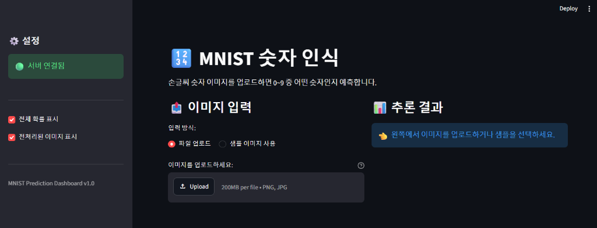
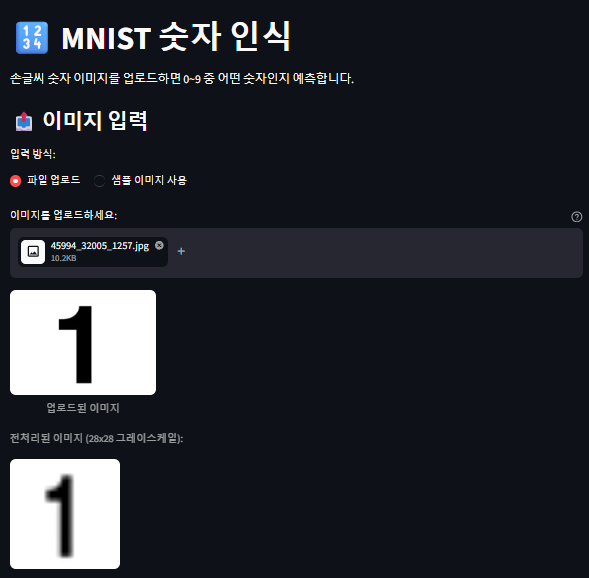
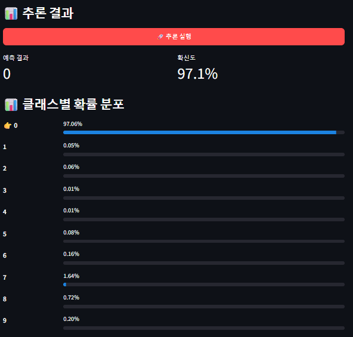
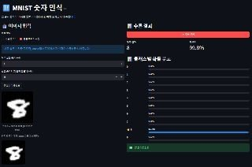
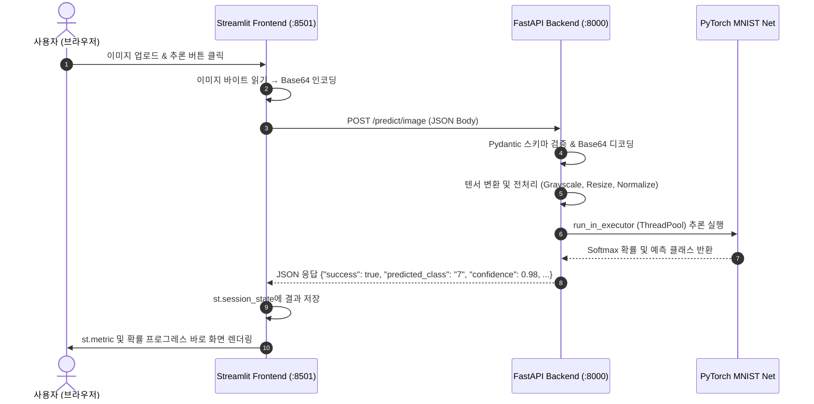

# Day 4 — Streamlit & System Architecture (DP04 제출)

## 📌 제출 미션 요약
1. **섹션 5 수행내역 캡쳐** (FastAPI 백엔드 연동 MNIST 추론 대시보드 화면 및 결과)
2. **각 섹션별 실행 내역 및 출력 결과 기록** (섹션 1 ~ 섹션 5)
3. **각 섹션 체크포인트 및 Day 4 최종 체크포인트 답변**

---

## 1. 섹션 5 수행내역 캡쳐

### 1.1 대시보드 접속 및 FastAPI 백엔드 연동 확인 (1번 캡쳐)
* Streamlit 대시보드 접속 시 사이드바에서 FastAPI 백엔드(`http://localhost:8000`)의 헬스체크 상태(`🟢 서버 연결됨`)를 정상적으로 확인하고, 이미지 입력 방식(파일 업로드 / 샘플 이미지 사용) 및 옵션을 설정할 수 있습니다.



---

### 1.2 이미지 파일 업로드 및 전처리 프리뷰 (2번 캡쳐)
* `45994_32005_1257.jpg` 손글씨 이미지 파일을 업로드했을 때, 업로드된 원본 이미지와 28×28 그레이스케일로 변환된 전처리 이미지가 화면에 정상 렌더링됩니다.



---

### 1.3 추론 실행 및 결과 시각화 (3번 캡쳐)
* **[🚀 추론 실행]** 버튼 클릭 시 이미지를 Base64로 인코딩하여 FastAPI 백엔드(`POST /predict/image`)로 전달하고, 반환된 예측 결과(예측 클래스, 확신도 97.1%) 및 0~9 클래스별 확률 분포를 Streamlit 프로그레스 바로 직관적으로 시각화합니다.



---

### 1.4 샘플 데이터 테스트 시나리오 및 검증 (4번 캡쳐)
* 입력 방식을 `샘플 이미지 사용`으로 전환하여 숫자 `8` 샘플을 선택/로드한 후 추론을 수행하여, 예측 클래스 `8`(확신도 96.87%)로 정상 분류되는 전체 파이프라인 흐름을 검증했습니다.



---

## 2. 각 섹션 실행 내역 및 코드

### [섹션 1] Streamlit 소개: Python만으로 만드는 웹 UI

#### 1.4 첫 번째 Streamlit 앱 (`frontend/app_hello.py`)
* **코드 내용**:
  ```python
  import streamlit as st

  st.title("MNIST 숫자 분류기")
  st.write("FastAPI 백엔드와 연동하는 Streamlit 프론트엔드입니다.")

  name = st.text_input("당신의 이름은?", "AI 엔지니어")
  st.write(f"환영합니다, **{name}**님!")

  if st.button("인사하기"):
      st.success(f"{name}님, 오늘 Day 4 실습을 시작합니다! 🚀")
  ```
* **실행 방법**:
  ```bash
  streamlit run frontend/app_hello.py --server.port 8501
  ```
* **핵심 개념**: 사용자의 입력 이벤트가 발생할 때마다 스크립트의 처음부터 끝까지 전체 코드가 위에서 아래로 순차 재실행(Re-run)됩니다.

---

### [섹션 2] Streamlit 핵심 컨셉

#### 2.1 자주 사용하는 위젯 및 레이아웃
* **파일 업로더**: `uploaded_file = st.file_uploader("이미지 선택", type=["png", "jpg", "jpeg"])`
* **컬럼 레이아웃**: `col1, col2 = st.columns(2)`를 통해 입력(왼쪽)과 결과(오른쪽)를 2단으로 직관적 배치
* **사이드바**: `with st.sidebar:`를 사용하여 API 서버 설정, 헬스체크 상태, 옵션 토글 배치
* **리소스 캐싱 (`@st.cache_resource`)**: 재실행 시마다 불필요한 객체 재성성을 막고 한 번만 초기화하여 공유

---

### [섹션 3] System Architecture: Frontend와 Backend의 역할 분리

#### 3.3 분리 아키텍처 및 통신 흐름



---

### [섹션 4] Streamlit에서 FastAPI 호출하기

#### 4.1 API 호출 함수 구현 (`call_api`)
* **코드 내용**:
  ```python
  def call_api(url, json_data=None, method="post"):
      """API를 호출하고, 실패 시 사용자 친화적 에러 메시지를 표시합니다."""
      try:
          if method == "get":
              resp = requests.get(url, timeout=10)
          else:
              resp = requests.post(url, json=json_data, timeout=30)
          resp.raise_for_status()
          return resp.json()
      except requests.exceptions.ConnectionError:
          st.error("🔌 **서버에 연결할 수 없습니다.** FastAPI 서버가 실행 중인지 확인하세요.")
          return None
      except requests.exceptions.Timeout:
          st.warning("⏱️ **응답 시간 초과.** 잠시 후 다시 시도하세요.")
          return None
      except requests.exceptions.HTTPError as e:
          st.error(f"❌ **서버 에러** (HTTP {e.response.status_code})")
          return None
      except Exception as e:
          st.error(f"⚠️ **예상치 못한 에러**: {e}")
          return None
  ```

---

### [섹션 5] MNIST 추론 대시보드 만들기 (`frontend/app_dashboard.py`)

#### 백엔드 서버 기동 및 로그 출력:
```text
2026-08-18 11:37:18 INFO     [ml_api] 모델 로드 중: models/mnist_state_dict.pth
2026-08-18 11:37:18 INFO     [ml_api] 모델 로드 완료
INFO:     Started server process [28492]
INFO:     Waiting for application startup.
INFO:     Application startup complete.
INFO:     Uvicorn running on http://127.0.0.1:8000 (Press CTRL+C to quit)
2026-08-18 11:37:55 INFO     [ml_api] GET /health → 200 (0.0s)
2026-08-18 11:38:10 INFO     [ml_api] POST /predict/image → 200 (0.015s)
```

---

## 3. 각 섹션 체크포인트 답변

### [섹션 1 체크포인트]

#### Q1. Streamlit의 스크립트 재실행 모델이란 무엇입니까?
* **답변**: 사용자가 버튼 클릭, 텍스트 입력, 파일 업로드 등 UI에서 상호작용(이벤트)을 일으킬 때마다, Streamlit이 해당 파이썬 스크립트 파일의 첫 번째 행부터 마지막 행까지 **전체 코드를 위에서 아래로 순차 재실행(Re-run)** 하는 동작 모델입니다.

#### Q2. `st.text_input()`에 값을 입력하면 내부적으로 어떤 일이 일어납니까?
* **답변**: 사용자가 입력한 문자열 값이 Streamlit 내부 세션 상태에 저장되고, 브라우저가 서버에 이벤트 발생을 알려 스크립트 전체가 재실행됩니다. 재실행 시 `st.text_input()`은 사용자가 입력한 최신 값을 반환하여 그 값을 사용하는 하위 UI 요소들이 새롭게 렌더링됩니다.

#### Q3. `st.set_page_config()`를 스크립트 중간에 호출하면 어떻게 됩니까?
* **답변**: `StreamlitAPIException` 에러가 발생합니다. `st.set_page_config()`는 브라우저 탭의 제목, 파비콘, 레이아웃(wide 모드 등)을 설정하는 함수이므로 반드시 다른 렌더링 함수나 Streamlit 명령보다 앞서 **스크립트의 맨 첫 번째 Streamlit 호출**로 실행되어야 합니다.

---

### [섹션 2 체크포인트]

#### Q1. `st.file_uploader()`로 업로드된 파일의 바이트 데이터는 어떻게 얻습니까?
* **답변**: `st.file_uploader()`가 반환하는 `UploadedFile` 객체는 파이썬의 `BytesIO`와 같은 파일 유사 객체(file-like object)이므로, `.read()` 메서드를 호출하여 바이너리 바이트(`bytes`) 데이터를 추출할 수 있습니다. (예: `image_bytes = uploaded_file.read()`)

#### Q2. Streamlit에서 `@st.cache_resource`를 사용하는 이유는 무엇입니까?
* **답변**: Streamlit은 위젯 이벤트마다 스크립트 전체를 다시 실행하므로, ML 모델, 데이터베이스 커넥션, HTTP 세션 클라이언트 등 **생성 비용이 크고 공유 가능한 글로벌 리소스를 메모리에 한 번만 생성하고 재사용**하여 성능 저하와 불필요한 리소스 낭비를 방지하기 위해 사용합니다.

---

### [섹션 3 체크포인트]

#### Q1. 모놀리식과 분리 아키텍처의 핵심 차이를 한 문장으로 설명하세요.
* **답변**: 모놀리식 아키텍처는 UI와 딥러닝 추론 연산이 하나의 단일 프로세스/서버에 강결합된 구조인 반면, 분리 아키텍처는 **사용자 인터페이스(Streamlit)와 모델 추론 엔진(FastAPI)이 독립된 서비스로 분리되어 표준 HTTP REST API(JSON)로 통신하는 구조**입니다.

#### Q2. 모델을 업데이트할 때, 분리 아키텍처에서는 어떤 서버만 재배포하면 됩니까?
* **답변**: 모델을 로드하고 추론을 직접 수행하는 **FastAPI 백엔드 서버**만 재배포하면 되며, 사용자 접점인 Streamlit 프론트엔드 서버는 재배포 없이 무중단으로 서비스할 수 있습니다.

#### Q3. Streamlit 앱에 PyTorch가 설치되어 있지 않아도 되는 이유는 무엇입니까?
* **답변**: 텐서 전처리, 신경망 순전파, GPU/CPU 행렬 연산 등 모델과 관련된 모든 무거운 연산은 백엔드인 FastAPI 서버에서 전담하며, Streamlit은 이미지 데이터를 Base64로 인코딩하여 HTTP 요청으로 보내고 응답받은 JSON(예측값, 확률)을 화면에 표시하는 역할만 하므로 PyTorch 라이브러리가 전혀 필요하지 않습니다.

---

### [섹션 4 체크포인트]

#### Q1. 이미지를 API에 전송할 때 Base64로 인코딩하는 이유는 무엇입니까?
* **답변**: HTTP 기반의 표준 JSON 페이로드는 텍스트 데이터만 지원하므로, 이진(binary) 형태의 이미지 바이트 데이터를 텍스트 기반 문자열(ASCII)로 변환(Base64 인코딩)하여 JSON의 필드 값으로 안전하게 포함시켜 전송하기 위함입니다.

#### Q2. `response.raise_for_status()`는 어떤 역할을 합니까?
* **답변**: HTTP 요청 결과 응답 코드가 4xx(클라이언트 오류: 400 Bad Request, 404 Not Found 등) 또는 5xx(서버 오류: 500 Internal Server Error 등) 상태일 때 `requests.exceptions.HTTPError` 예외를 즉시 발생시켜, `try-except` 블록에서 에러 상황을 명확하게 감지하고 처리할 수 있도록 돕습니다.

---

## 4. Day 4 최종 종합 체크포인트

```
[섹션 1: Streamlit 소개]
Q1. Streamlit의 스크립트 재실행 모델이란?

[섹션 2: 핵심 컨셉]
Q2. @st.cache_resource를 사용하는 이유는?

[섹션 3: System Architecture]
Q3. 프론트엔드와 백엔드를 분리하는 핵심 이유 두 가지는?
Q4. Streamlit 앱에 PyTorch가 필요 없는 이유는?

[섹션 4: API 호출]
Q5. API 호출 실패 시 사용자에게 스택 트레이스가 아닌 메시지를 보여줘야 하는 이유는?

[섹션 5: 실습]
Q6. st.session_state에 결과를 저장하는 이유는?
Q7. 이미지를 API로 전달할 때 Base64 인코딩이 필요한 이유는?
```

### 📋 최종 체크포인트 상세 답변

* **Q1. Streamlit의 스크립트 재실행 모델이란?**
  * 사용자가 UI 요소를 조작(버튼 클릭, 텍스트 입력, 옵션 선택 등)하여 이벤트가 발생할 때마다, 해당 파이썬 스크립트의 첫 줄부터 끝 줄까지 전체 코드를 처음부터 다시 실행하는 방식입니다.

* **Q2. `@st.cache_resource`를 사용하는 이유는?**
  * 스크립트가 매번 재실행될 때마다 비용이 큰 객체(DB 커넥션, 클라이언트 인스턴스, 머신러닝 모델 등)를 다시 로드하거나 초기화하지 않고, 메모리에 캐싱하여 모든 재실행 및 세션에서 공유·재사용하기 위함입니다.

* **Q3. 프론트엔드와 백엔드를 분리하는 핵심 이유 두 가지는?**
  1. **독립적인 개발·배포 및 스케일링(Scale-out)**: 모델 업데이트 시 백엔드만 재배포하면 되고, 트래픽 폭증 시 GPU/CPU 부하가 큰 백엔드 인스턴스만 독립적으로 확장할 수 있습니다.
  2. **다양한 클라이언트 지원 및 보안 강화**: 단일 FastAPI 백엔드를 웹(Streamlit/React), 모바일 앱, 외부 시스템 등 여러 클라이언트가 공용으로 활용할 수 있으며, 모델 가중치 파일이 프론트엔드에 노출되지 않아 지적재산권과 시스템 보안을 지킬 수 있습니다.

* **Q4. Streamlit 앱에 PyTorch가 필요 없는 이유는?**
  * 추론에 필요한 모든 딥러닝 연산은 FastAPI 백엔드에서 수행되며, Streamlit은 이미지 데이터를 인코딩하여 HTTP JSON으로 전달하고 반환된 결과만 시각화하므로 딥러닝 프레임워크가 필요 없습니다.

* **Q5. API 호출 실패 시 사용자에게 스택 트레이스가 아닌 메시지를 보여줘야 하는 이유는?**
  * 스택 트레이스에 포함된 서버의 내부 디렉토리 경로, 라이브러리 버전, 코드 구조 등 민감한 시스템 정보의 노출을 막아 **보안 취약점 공격을 예방**하고, 사용자에게는 "서버 점검 중", "네트워크 확인 필요"와 같은 **친절하고 이해하기 쉬운 안내 메시지**를 제공하여 사용자 경험을 개선하기 위함입니다.

* **Q6. `st.session_state`에 결과를 저장하는 이유는?**
  * Streamlit은 다른 위젯을 건드리거나 옵션을 바꿀 때마다 스크립트를 재실행하므로, 이전 추론 결과가 화면에서 지워지지 않고 브라우저 탭 세션 동안 지속적으로 유지 및 렌더링되도록 상태를 보존하기 위함입니다.

* **Q7. 이미지를 API로 전달할 때 Base64 인코딩이 필요한 이유는?**
  * REST API의 통신 표준인 JSON 포맷은 바이너리 데이터를 직접 포함할 수 없는 텍스트 포맷이므로, 바이너리 이미지 바이트를 텍스트 문자열로 변환하여 JSON 요청 본문(Body)에 담기 위해 Base64 인코딩이 필요합니다.

---

## 5. 프로젝트 구조 및 파일 명세

```text
model-serving-course/
├── app/                        # FastAPI 백엔드
│   ├── __init__.py
│   ├── main_final.py           # 최종 통합 서빙 서버 (비동기 + 로깅 + 에러핸들러)
│   ├── model_utils.py          # PyTorch 분류기 구조 정의 및 모델 로드/추론 유틸
│   ├── schemas.py              # Pydantic V2 데이터 검증 스키마
│   ├── logger_config.py        # 로깅 포맷 설정
│   ├── middleware.py           # 응답 시간 로깅 미들웨어
│   └── error_handlers.py       # 전역 에러 핸들러
├── frontend/                   # Streamlit 프론트엔드
│   ├── app_hello.py            # Streamlit 기초 예제
│   └── app_dashboard.py        # MNIST 실시간 추론 대시보드 웹앱
├── notebooks/                  # 실습 주피터 노트북
│   ├── 모델배포개론01.ipynb      # Day 1: 모델 저장 포맷 비교
│   ├── 모델배포개론02.ipynb      # Day 2: FastAPI 기초
│   ├── 모델배포개론03.ipynb      # Day 3: 비동기 처리 및 로깅
│   └── 모델배포개론04.ipynb      # Day 4: Streamlit 대시보드 연동
├── models/                     # 학습 완료된 가중치
│   └── mnist_state_dict.pth    # MNIST PyTorch 가중치
├── data/                       # MNIST 원본 데이터
├── images/                     # 퀘스트 제출 캡쳐 이미지 (1, 2, 3, 4번 스크린샷)
├── quests/                     # 과제 제출 리포트
│   ├── Quest0813.md            # DP02 제출
│   ├── Quest0814.md            # DP03 제출
│   └── Quest0818.md            # DP04 제출 (본 파일)
└── tests/                      # 백엔드 단위 테스트 스위트
    ├── __init__.py
    └── test_api.py             # FastAPI TestClient 자동화 테스트
```

---

## 6. 회고 및 학습 정리

* **배운 점**:
  - 모놀리식 구조와 프론트엔드-백엔드 분리 아키텍처의 구조적 차이와 이점을 명확히 체득했습니다.
  - Streamlit의 고유한 스크립트 재실행 모델(Re-run)과 이를 효과적으로 제어하기 위한 `st.cache_resource`, `st.session_state`의 역할을 깊이 이해했습니다.
  - 이진 이미지 데이터를 Base64 인코딩을 통해 JSON REST API로 안전하게 직렬화/역직렬화하고, 백엔드의 `ThreadPoolExecutor`와 결합하여 고성능 비동기 서빙 시스템을 완성할 수 있었습니다.
* **아쉬운 점 및 개선 방향**:
  - 현재 모델은 간단한 CNN 구조(3 Epoch 학습)로 작성되어 손글씨의 굵기나 위치에 따라 일부 오분류가 발생할 수 있습니다. 추후 데이터 증강(Augmentation) 및 모델 튜닝을 통해 인식률을 개선하거나, 캔버스 드로잉 컴포넌트(`streamlit-drawable-canvas`)를 추가 도입하면 사용자 인터랙션을 더욱 극대화할 수 있을 것입니다.
