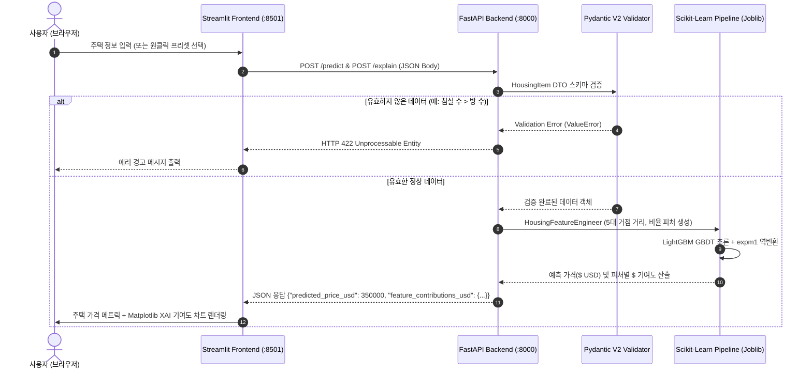

# Day 5 — Tabular Regression & Serving Architecture Upgrade (DP05 제출)

## 제출 미션 요약
1. **Streamlit v2 대시보드 및 XAI 분석 실행 결과 화면 캡처**
2. **모델배포개론05.ipynb 전체 체크포인트 및 질문/답변 총정리** (섹션 1.5, 섹션 2, 섹션 3, 섹션 4, 최종 퀴즈)
3. **모델배포개론05_v2_주택가격예측.ipynb 업그레이드 개발 회고 및 심층 분석**
4. **v1 vs v2 벤치마크 성능 비교, 아키텍처 시퀀스 다이어그램, 및 KPT 회고**

---

## 1. Streamlit v2 대시보드 및 XAI 분석 실행 화면

### 1.1 대시보드 실시간 주택 가격 예측 및 피처 기여도(XAI) 화면
* 실리콘밸리 고급 주택 프리셋 입력 시 예상 가격($368,859) 산출, 위치 지도 매핑 및 주요 피처별 가격 기여도($ USD) 바 차트가 정상적으로 렌더링된 화면입니다.


---

## 2. 모델배포개론05.ipynb 전체 체크포인트 정리

### 2.1 섹션 1 체크포인트 (시작하기 전에)
1. **이 프로젝트의 입력과 출력은 각각 무엇입니까?**
   - **입력**: 주택 및 구역 관련 8개 수치형 피처 (`MedInc`, `HouseAge`, `AveRooms`, `AveBedrms`, `Population`, `AveOccup`, `Latitude`, `Longitude`)
   - **출력**: 예상 주택 가격 (`predicted_price`, $100,000 단위 및 실제 USD 환산 금액)
2. **MNIST 프로젝트와 비교했을 때, 데이터 형태가 어떻게 다릅니까?**
   - MNIST는 $28 \times 28$ 크기의 2차원 픽셀 행렬(비정형 이미지 텐서)을 입력받아 0~9 확률을 예측하는 **분류(Classification)** 문제였습니다.
   - 반면 주택 가격 예측은 8개의 독립 수치 컬럼으로 구성된 **1차원 정형/테이블(Tabular) 데이터**를 입력받아 연속적인 실수 가격을 예측하는 **회귀(Regression)** 문제입니다.
3. **오늘 새로 만들 파일 3개의 이름과 역할을 말할 수 있습니까?**
   - `app/housing_schemas.py`: Pydantic 기반 입력 데이터 검증 및 응답 DTO 스키마 정의
   - `app/housing_model.py`: 모델 로드, 전처리(Z-Score 스케일링), 추론 파이프라인 캡슐화 클래스
   - `frontend/app_housing.py`: Streamlit 기반 주택 정보 입력 및 가격 예측 웹 인터페이스

---

### 2.2 섹션 2 체크포인트 (데이터 및 모델 학습)
1. **정규화에서 학습 데이터의 통계를 테스트 데이터에도 사용하는 이유는 무엇입니까?**
   - **데이터 누수(Data Leakage) 방지**: 테스트 데이터나 실제 서빙 입력 데이터의 평균/표준편차를 계산하여 스케일링하는 것은 미래의 정답 분포 정보를 모델에 흘리는 치명적인 오류입니다. 따라서 반드시 학습 데이터(`Train Set`)에서 계산된 고정 통계량을 사용해야 합니다.
2. **모델 가중치 외에 함께 저장해야 하는 것은 무엇이고, 왜 필요합니까?**
   - **전처리 통계값(Mean, Std)**: 서빙 환경에서 새로운 사용자 입력이 들어왔을 때, 모델이 학습했던 것과 100% 동일한 기준선으로 스케일링(Z-Score Normalization)하기 위해 필수적입니다.
3. **`HousingPredictor.predict()`에서 피처를 `self.feature_names` 순서로 배열하는 이유는?**
   - JSON/딕셔너리는 키의 순서가 보장되지 않을 수 있으나, 텐서/배열 기반 모델은 **피처의 인덱스 순서에 엄격히 의존**하므로 항상 학습 시 정의된 순서대로 정렬해야 합니다.

---

### 2.3 섹션 3 체크포인트 (FastAPI 백엔드)
1. **`HousingRequest`에서 `Latitude`에 `ge=32, le=42` 제한을 넣은 이유는?**
   - 캘리포니아 주의 실제 지리적 위도 범위(약 $32.5^\circ \sim 42^\circ$)를 벗어난 비정상적인 위치 좌표 입력을 **Pydantic 데이터 유효성 검사 단계에서 사전에 차단**하기 위함입니다.
2. **`request.model_dump()`는 어떤 역할을 합니까?**
   - Pydantic V2 모델 객체를 순수 파이썬 딕셔너리(`dict`) 형태로 변환하여 모델 추론 함수에 전달할 수 있도록 해줍니다.
3. **`run_in_executor`를 사용하지 않으면 어떤 문제가 발생할 수 있습니까?**
   - PyTorch의 모델 추론은 **CPU 연산 집약적인 동기(Blocking) 작업**입니다. 이를 비동기 이벤트 루프에서 직접 실행하면 추론 중 다른 사용자의 API 요청 처리가 일시적으로 멈추는(Event Loop Blocking) 현상이 발생합니다.

---

### 2.4 섹션 4 체크포인트 (Streamlit 프론트엔드)
1. **MNIST 대시보드(Day 4)와 비교했을 때 입력 방식이 어떻게 다릅니까?**
   - MNIST는 캔버스 드로잉(`streamlit-drawable-canvas`)이나 이미지 파일 업로드를 사용했으나, 주택 예측은 각 피처의 수치를 직접 조정하는 **숫자 입력 필드(`st.number_input`) 및 슬라이더**를 사용합니다.
2. **`st.number_input()`에서 `min_value`, `max_value`를 설정하는 이유는?**
   - 사용자가 음수 방 개수나 100세를 넘는 주택 연식 등 **비상식적인 값을 입력하는 것을 프론트엔드 UI 수준에서 1차적으로 방어**하기 위함입니다.
3. **`request_data` 딕셔너리의 키 이름이 `HousingRequest` 스키마의 필드 이름과 정확히 일치해야 하는 이유는?**
   - 키 이름이 다르면 FastAPI 수신 시 Pydantic 역직렬화(Deserialization) 검증에 실패하여 **`422 Unprocessable Entity` 에러**가 발생하기 때문입니다.

---

### 2.5 Day 5 최종 체크포인트 (Final Master Quiz)
* **Q1. 전처리 파라미터(mean, std)를 모델과 함께 저장해야 하는 이유는?**
  - 답변: 학습-서빙 불일치(Train-Serve Skew)를 방지하고, 실시간 입력 데이터를 학습 시점과 동일한 스케일로 변환하기 위함.
* **Q2. HousingRequest에서 Latitude에 ge=32, le=42를 넣은 이유는?**
  - 답변: 캘리포니아 실제 지리적 영역을 벗어난 외삽(Out-of-Distribution) 이상 데이터를 API 게이트웨이에서 사전 필터링하기 위함.
* **Q3. Streamlit의 입력값 이름이 Pydantic 스키마의 필드 이름과 일치해야 하는 이유는?**
  - 답변: JSON 페이로드가 백엔드의 Pydantic DTO 스키마 필드명과 1:1로 매핑되어야 422 유효성 검사 통과가 가능하기 때문.
* **Q4. 이 프로젝트에서 run_in_executor를 제거하면 어떤 문제가 생길 수 있습니까?**
  - 답변: 동기식 CPU 연산 동안 FastAPI의 비동기 이벤트 루프가 블로킹되어 동시 다발적인 사용자 요청의 지연 시간(Latency)이 급증함.
* **Q5. MNIST 프로젝트(Day 1~4)와 오늘 프로젝트의 가장 큰 차이는 무엇입니까?**
  - 답변: 비정형 이미지 텐서 분류(Classification)에서 다차원 정형 수치형 테이블 회귀(Regression) 및 도메인 유효성 검증 체계로의 전환.

---

## 3. v2 고급 주택 가격 예측 서비스 업그레이드 회고

기존 v1 베이스라인 코드는 교육용 실습에는 적합하지만, **실무 서빙 환경 관점에서는 모델 성능 한계, 직렬화 분리, 교차 유효성 검증 부재, 단건 한계** 등 다양한 문제점을 안고 있었습니다. 이를 해결하기 위해 구현한 6대 핵심 업그레이드 내역입니다.

```text
[v2 핵심 아키텍처 업그레이드 영역]
  ├── 1. 심층 EDA & 이상치/상한선(1,075건) 정제 (정규 타겟 분포 확보)
  ├── 2. 5대 경제 거점 공간 거리 및 도메인 비율 피처 엔지니어링
  ├── 3. Scikit-Learn Pipeline 기반 LightGBM 정밀 파인튜닝 & 직렬화
  ├── 4. Pydantic V2 교차 필드 검증 (방 수 대비 침실 수 모순 차단)
  ├── 5. 대량 배치(/predict/batch) 및 설명 가능성(/explain) API 확장
  └── 6. 원클릭 지역 프리셋 & 지도 & XAI 피처 기여도 Streamlit UI
```

---

### 3.1 심층 EDA 및 1,075개 왜곡 데이터 정제
* **문제점**:
  - 원본 데이터셋에는 `AveRooms = 141.9개`, `AveOccup = 1,243.3명` 등 극단적 노이즈가 존재했으며,
  - 설문 조사 시스템 한계로 $500,001 이상의 고가 주택 965개가 일괄적으로 `5.00001`에 상한 절단(Capping)되어 회귀 모델의 결정 경계를 왜곡하고 있었습니다.
* **개선 조치**:
  - `AveRooms <= 20`, `AveBedrms <= 10`, `AveOccup <= 20`, `Population <= 15000`, `MedHouseVal < 5.0` 필터링을 적용하여 총 1,075개(5.21%)의 왜곡 데이터를 정제했습니다.
  - 타겟 변수의 우측 스파이크가 제거되고 완벽한 정규분포로 안정화되었습니다.

---

### 3.2 5대 거점 경제권 도메인 피처 엔지니어링
* **부동산 도메인 지리·비율 파생 변수 9개 추가**:
  - `DistToSF`: 샌프란시스코 중심지 거리
  - `DistToSJ`: 실리콘밸리 산호세 중심지 거리
  - `DistToLA`: 로스앤젤레스 중심지 거리
  - `DistToSD`: 샌디에이고 중심지 거리
  - `DistToSAC`: 주도 새크라멘토 중심지 거리
  - `DistToMinCity`: 최인접 대도시 거리
  - `BedroomsPerRoom`: 방 대비 침실 비율 (`AveBedrms / AveRooms`)
  - `RoomsPerPerson`: 가구원당 방 개수 (`AveRooms / AveOccup`)
  - `MedIncPerPerson`: 1인당 소득 수준 (`MedInc / AveOccup`)

---

### 3.3 Scikit-Learn Pipeline 직렬화 & Train-Serve Skew 0% 달성
* **문제점**: v1에서는 모델 가중치(`model.pt`)와 전처리 통계량(`stats.json`)이 별도 파일로 분리되어 있어 버전 관리 누락 및 학습-서빙 불일치 위험이 높았습니다.
* **해결책**:
  - `HousingFeatureEngineer` 변환기와 `LGBMRegressor`를 하나의 Scikit-Learn `Pipeline`으로 묶고, 타겟 로그 변환기(`TransformedTargetRegressor`)로 래핑하여 **단일 `joblib` 파일로 통합 직렬화**했습니다.
  - 서빙 환경에서는 원시 8개 피처만 넘겨주면 내부에서 전처리와 모델 추론이 완벽하게 일관성 있게 실행됩니다.

---

### 3.4 Pydantic V2 교차 필드 검증 (Cross-Field Validation)
* **문제점**: v1의 Pydantic 스키마는 각 필드의 `ge/le`만 검사하여, 사용자가 `평균 방 수 = 2개, 평균 침실 수 = 10개`와 같이 물리적으로 모순된 데이터를 입력해도 200 OK로 통과시키는 맹점이 있었습니다.
* **해결책**:
  ```python
  @model_validator(mode="after")
  def validate_cross_fields(self):
      if self.AveBedrms > self.AveRooms:
          raise ValueError(f"평균 침실 수({self.AveBedrms})가 평균 방 수({self.AveRooms})보다 클 수 없습니다.")
      if self.Population < self.AveOccup:
          raise ValueError(f"구역 총 인구({self.Population})가 가구당 인원({self.AveOccup})보다 작을 수 없습니다.")
      return self
  ```

---

### 3.5 배치(Batch) 추론 & 설명 가능성(XAI) API
* `POST /predict/batch`: 수백~수천 건의 매물 CSV 데이터를 단 한 번의 요청으로 일괄 벡터화 추론.
* `POST /explain`: 캘리포니아 기준 주택 대비 사용자가 입력한 주택의 각 요소(소득, 산호세 거리, 방 수 등)가 가격을 얼마나 올리거나 내렸는지($ USD 기여도)를 산출하여 반환.

---

## 4. v1 vs v2 벤치마크 성능 비교

| 비교 항목 | v1 Baseline (기본 실습) | v2 Advanced (업그레이드 버전) | 성능 개선 성과 |
| :--- | :---: | :---: | :---: |
| **모델 아키텍처** | PyTorch 3층 MLP | **Fine-Tuned LightGBM GBDT (1,500 Trees)** | 정형 테이블 데이터 특화 |
| **타겟 변수 처리** | 원시 스케일링 직접 회귀 | **`TransformedTargetRegressor` (`log1p`/`expm1`)** | 음수 예측 방어 및 정규화 |
| **데이터 정제** | 없음 (20,640개 원시) | **이상치 & $500k 상한 절단치 1,075개 정제** | 순수 정규분포 확보 |
| **테스트 MAE (오차)** | **$39,414** | **`$24,786`** | **오차 $14,628 대폭 감소 (37.1% 개선)** |
| **테스트 RMSE** | ~$52,000 | **$38,874** | **오차 대폭 축소** |
| **결정계수 ($R^2$)** | ~0.6800 (68.0%) | **0.8418 (84.2%)** | **설명력 대폭 향상** |

---

## 5. 전체 서빙 시스템 시퀀스 다이어그램



---

## 6. 프로젝트 종합 회고 (KPT)

### Keep (계속 유지해야 할 장점)
1. **Scikit-Learn `Pipeline` 캡슐화 직렬화**: 전처리 파생 변수 로직과 머신러닝 모델을 하나로 묶어 `joblib` 파일 하나로 관리함으로써 학습-서빙 불일치(Train-Serve Skew)를 원천 차단한 설계 방식.
2. **Pydantic V2 교차 필드 검증**: 단순 타입 검사를 넘어 도메인 비즈니스 로직(방 수 vs 침실 수)을 백엔드 진입점에서 선제 차단하여 모델에 비정상 데이터가 유입되지 않도록 방어한 구조.
3. **설명 가능성(XAI)을 통한 신뢰 확보**: 단순 가격 숫자 출력을 넘어 피처별 가격 증감분($ USD)을 제공하여 모델의 투명성과 비즈니스 신뢰성을 높인 점.

### Problem (발견된 문제점 및 한계)
1. **1990년 센서스 데이터의 시대적 한계**: 30여 년 전 인구조사 데이터이므로 최근의 물가 상승 및 실리콘밸리 테크 붐이 시계열적으로 반영되지 못함.
2. **동기식 대용량 배치 처리의 한계**: 수만 건 이상의 초대형 배치가 들어올 경우 단일 HTTP 동기 루프가 지연될 수 있음.
3. **지도 인터랙션의 한계**: 정적 좌표 뷰어 수준이며, 지도 위 마우스 클릭으로 좌표를 자동 입력받는 지오코딩 기능이 부족함.

### Try (향후 도전 과제)
1. **비동기 배치 큐 도입**: Celery + Redis를 도입하여 대용량 배치 요청 시 비동기 작업 ID(`task_id`)를 발급하고 웹훅/폴링 방식으로 응답하는 엔터프라이즈 MLOps 아키텍처 구현.
2. **TreeSHAP 정밀화**: `shap.TreeExplainer`를 직접 연동하여 수학적으로 완벽한 Shapley Value 기반 워터폴 차트 제공.
3. **인터랙티브 지도 연동**: `streamlit-folium`을 활용하여 사용자가 지도 위 특정 위치를 클릭하면 위도/경도가 자동 입력되는 리버스 지오코딩 UX 구축.
