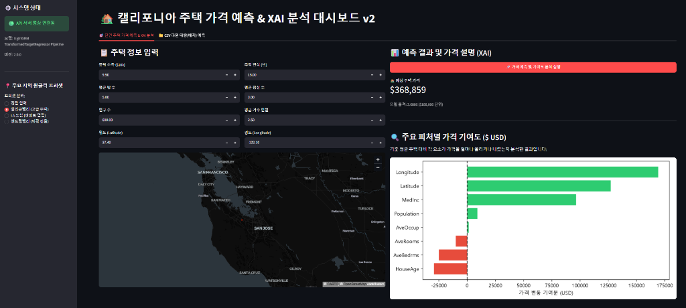

# AIFFEL Campus Online Code Peer Review Template
- 코더 : 천세문
- 리뷰어 : 채진현

# PRT(Peer Review Template)

- [x] **1. 주어진 문제를 해결하는 완성된 코드가 제출되었나요?**
    - v2 노트북의 전체 코드 셀이 실행된 상태(`execution_count` 1~15)로 제출되었고, 데이터 분석부터 모델 학습·직렬화, FastAPI 백엔드, Streamlit 프론트엔드, 통합 테스트까지 하나의 흐름으로 구현되어 있습니다.
    - 모델 성능 평가 결과(셀 10):

      | 지표 | v1 Baseline MLP | v2 LightGBM |
      |---|---:|---:|
      | MAE | $39,414 | **$24,786** |
      | R² | 약 0.6800 | **0.8418** |

      v2에서 MAE가 `$14,628` 감소했고, 실행 결과에서 학습된 파이프라인이 `models/housing_advanced_pipeline.joblib`에 저장된 것도 확인할 수 있습니다.
    - API 통합 테스트(셀 15)에서 단건 예측 `/predict`는 `200`, 모순 입력은 `422`, 설명 API `/explain`은 `200`, 배치 예측 `/predict/batch`는 `200`을 반환했습니다. 정상 경로뿐 아니라 검증 실패 경로까지 함께 테스트한 점이 좋았습니다.
    - Streamlit 대시보드에서 단건 예측, 지도, 피처 기여도 그래프와 CSV 배치 예측 기능을 확인할 수 있습니다.

      

- [x] **2. 전체 코드에서 가장 핵심적이거나 가장 복잡하고 이해하기 어려운 부분에 작성된 주석 또는 doc string을 보고 해당 코드가 잘 이해되었나요?**
    - 가장 핵심적인 부분은 셀 9의 `HousingFeatureEngineer`입니다. 원본 8개 피처에서 방·침실·거주 인원 비율 3개와 캘리포니아 5대 경제 거점까지의 거리 및 최단 거리 피처를 생성하고, 이 변환기를 학습과 서빙에서 공통으로 사용합니다.
    - `BaseEstimator`, `TransformerMixin`을 상속해 Scikit-Learn `Pipeline`에 결합한 목적이 클래스 docstring과 단계별 주석으로 드러납니다. 원시 입력을 받는 서빙 코드가 학습 당시와 동일한 피처 변환을 재사용하므로 Train-Serve Skew를 줄이는 구조를 이해하기 쉬웠습니다.
    - 셀 11의 `HousingItem.validate_cross_fields()`도 주석을 통해 단일 필드 범위 검사를 넘어 `AveBedrms <= AveRooms`, `AveOccup <= Population`이라는 도메인 관계를 검사한다는 점이 명확합니다.
    - `HousingAdvancedPredictor`의 `predict`, `predict_batch`, `explain` 메서드가 역할별로 분리되고 각각 짧은 docstring을 갖고 있어 API 엔드포인트와 추론 로직의 대응 관계도 쉽게 파악할 수 있었습니다.

- [x] **3. 에러가 난 부분을 디버깅하여 문제를 해결한 기록을 남겼거나 새로운 시도 또는 추가 실험을 수행해봤나요?**
    - 별도의 디버깅 일지는 없지만, 비정상 요청을 의도적으로 만들어 검증 로직을 확인하는 테스트가 포함되어 있습니다. `AveRooms=2.0`, `AveBedrms=10.0` 입력에 대해 Pydantic 교차 필드 검증이 `422 Unprocessable Entity`와 구체적인 오류 메시지를 반환했습니다.
    - 원본 20,640건에서 극단값과 타겟 상한 절단 데이터를 필터링해 19,565건을 남기는 추가 실험을 수행했고, 제거량 `1,075건(5.21%)`을 실행 결과로 기록했습니다.
    - v1의 PyTorch MLP 대신 정형 데이터에 적합한 LightGBM을 적용하고, `log1p`/`expm1` 타겟 변환, 9개의 도메인 파생 피처, 단건·배치·설명 API까지 확장한 점은 평가 기준을 넘어선 의미 있는 시도입니다.
    - 프론트엔드에도 지역 프리셋, 지도, CSV 예제 다운로드, 배치 결과 다운로드를 추가하여 모델 성능뿐 아니라 실제 사용 흐름까지 실험했습니다.
    - 다만 LightGBM 파라미터가 어떤 탐색 공간과 검증 점수로 선택되었는지는 기록되어 있지 않습니다. GridSearchCV, Optuna 또는 교차 검증 결과를 남기면 “최적 파인튜닝”의 재현성과 설득력이 더 높아질 것 같습니다.

- [x] **4. 회고를 잘 작성했나요?**
    - 마지막 셀에 v1과 v2의 모델, 피처 엔지니어링, 데이터 정제, 직렬화, 검증, API, UI, MAE를 항목별로 비교하여 개선 의도를 한눈에 볼 수 있습니다.
    - 학습-서빙 일관성, 다층 데이터 검증, 타겟 변환, 설명 가능성이라는 네 가지 설계 원칙을 구현 코드와 연결해 정리한 점이 좋았습니다.
    - `Quest0819.md`에는 전체 요청 흐름을 나타내는 Mermaid 시퀀스 다이어그램과 KPT 회고도 있어 결과 요약뿐 아니라 시스템 구조와 후속 개선 방향까지 확인할 수 있습니다.
    - 아쉬운 점은 일부 결론이 다소 강하게 표현되었다는 것입니다. 예를 들어 이상치 제거 후 분포를 “완벽한 정규분포”, 현재 결과를 “현업 프로덕션 수준”이라고 단정하기보다는 왜도·정규성 검정, 부하 테스트, 모니터링, 배포 환경 검증 등의 근거와 함께 범위를 한정하면 더 신뢰도 높은 회고가 됩니다.

- [x] **5. 코드가 간결하고 효율적인가요?**
    - 모델 및 피처 변환(`housing_advanced_model.py`), 요청·응답 스키마(`housing_advanced_schemas.py`), API(`housing_advanced_api.py`), UI(`app_housing_advanced.py`)로 관심사를 분리해 각 파일의 책임이 명확합니다.
    - 단건과 배치 예측이 동일한 `self.feature_names`와 직렬화된 파이프라인을 사용하므로 피처 순서 및 전처리 로직의 중복을 줄였습니다. 배치 예측도 행별 반복 호출 대신 DataFrame 전체를 한 번에 추론합니다.
    - Pydantic 응답 모델과 타입 힌트를 사용하고 함수·클래스 이름도 역할을 잘 드러냅니다. 전반적인 들여쓰기와 명명 규칙도 PEP8에 가깝게 작성되어 있습니다.
    - 개선할 부분도 있습니다. FastAPI의 `async def` 안에서 CPU 기반 동기 추론을 직접 호출하므로 요청량이 늘면 이벤트 루프를 막을 수 있습니다. `run_in_threadpool` 또는 작업 큐를 고려할 수 있습니다.
    - `explain()`은 피처 하나씩 기준값으로 치환해 예측 차이를 구하는 방식이라 피처 간 상호작용에 따라 기여도가 중복될 수 있고 합이 전체 예측 차이와 일치하지 않습니다. 함수명·화면 문구를 “간이 민감도 분석”으로 명확히 하거나 TreeSHAP으로 교체하면 설명의 정확성이 높아집니다.

# 회고(참고 링크 및 코드 개선)

```text
이번 코드는 단순히 회귀 모델을 학습하는 데서 끝나지 않고, 입력 검증부터 모델 직렬화,
API, 사용자 화면, 정상·실패 요청 테스트까지 실제 서비스의 구성 요소를 연결했다는 점이
가장 인상적이었습니다. 특히 피처 엔지니어링과 모델을 하나의 Pipeline으로 저장한 구조는
학습 코드와 서빙 코드에서 전처리가 달라지는 문제를 줄이는 좋은 선택이라고 생각합니다.

체크포인트 측면에서는 MAE와 R²만 출력한 것보다 v1과 v2를 같은 표로 비교하고, 단건 예측뿐
아니라 422 검증 실패와 배치 API까지 실제 HTTP 응답으로 확인한 점이 좋았습니다. 코드를 읽는
사람이 “기능이 구현되었다”는 설명에 의존하지 않고 실행 결과로 판단할 수 있었습니다.

다만 성능 비교를 더 엄밀하게 하려면 v1과 v2가 동일한 train/test split에서 평가되었는지,
하이퍼파라미터 선택에 테스트셋이 반복 사용되지는 않았는지 명시할 필요가 있습니다. 상한값
데이터 965건을 제거하면 고가 주택 구간의 서비스 성능을 평가할 수 없으므로, 제거 전·후 모델의
전체 테스트셋 및 가격 구간별 MAE를 함께 제시하면 데이터 정제의 효과와 손실을 더 공정하게
판단할 수 있을 것 같습니다.
```
