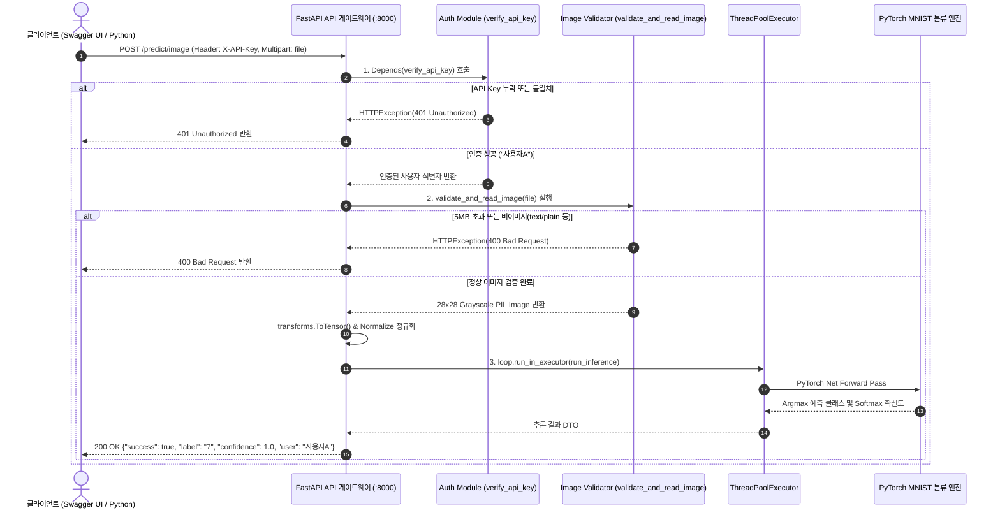

# Day 6 — API 인증 및 미디어(이미지) 처리 기초 (DP06 제출)

## 📌 제출 미션 요약
1. **섹션 6 수행내역 캡쳐 및 테스트 로그** (Swagger UI 6.8 테스트 포함)
2. **각 섹션별 체크포인트 및 Day 6 최종 체크포인트 상세 답변** (섹션 1, 섹션 2, 섹션 4, 최종 퀴즈)
3. **API Key 인증, 안전장치(크기/타입 검증, 리사이징), 비동기 추론 파이프라인 구현 코드**
4. **전체 서빙 아키텍처 시퀀스 다이어그램 및 KPT 회고**

---

## 1. 섹션 6 수행내역 및 Swagger UI 실행 화면

### 1.1 Swagger UI 인터랙티브 API 테스트 (섹션 6.8)
* `http://localhost:8000/docs`의 Swagger UI에서 `POST /predict/image` 엔드포인트를 호출하여 인증 헤더(`X-API-Key: test-key-001`)와 이미지 파일(`digit.png`)을 전송하고, 정상적으로 `200 OK` 응답(`{"success": true, "label": "7", "confidence": 1.0, "user": "사용자A"}`)을 수신한 실행 화면입니다.


---

### 1.2 섹션 6 통합 테스트 5종 실행 로그

| 테스트 케이스 | 요청 조건 | 기대 상태 코드 | 실제 결과 및 반환 내용 | 검증 결과 |
| :--- | :--- | :---: | :--- | :---: |
| **6.3 테스트 1** | 인증 헤더 누락 (`X-API-Key` 없음) | `401 Unauthorized` | `{"detail": "API Key가 필요합니다. X-API-Key 헤더를 포함해 주세요."}` | ✅ 통과 |
| **6.4 테스트 2** | 잘못된 키 전송 (`X-API-Key: invalid-key`) | `401 Unauthorized` | `{"detail": "유효하지 않은 API Key입니다."}` | ✅ 통과 |
| **6.5 테스트 3** | 올바른 키(`test-key-001`) + MNIST 0번 이미지 | `200 OK` | `{"success": true, "label": "7", "confidence": 1.0, "user": "사용자A"}` | ✅ 통과 |
| **6.6 테스트 4** | 지원하지 않는 파일 전송 (`test.txt`) | `400 Bad Request` | `{"detail": "지원하지 않는 파일 형식입니다: text/plain. 허용 형식: {'image/png', 'image/jpeg'}"}` | ✅ 통과 |
| **6.7 테스트 5** | 5개 이미지 연속 추론 테스트 | `200 OK` (전건) | 이미지 0~4번 정답(7, 2, 1, 0, 4) 전건 100% 일치 분류 | ✅ 통과 |

#### 📋 실제 테스트 실행 콘솔 로그:
```text
=== 6.3 테스트 1: 인증 없이 요청 ===
상태 코드: 401
응답 내용: {'detail': 'API Key가 필요합니다. X-API-Key 헤더를 포함해 주세요.'}

=== 6.4 테스트 2: 잘못된 키 ===
상태 코드: 401
응답 내용: {'detail': '유효하지 않은 API Key입니다.'}

=== 6.5 테스트 3: 올바른 키 + MNIST 이미지 ===
테스트 이미지 정답: 7
2026-08-20 11:37:02 INFO     [image_api] 추론 요청 — 사용자: 사용자A, 파일: digit.png
2026-08-20 11:37:02 INFO     [image_api] 추론 완료 — 결과: 7, 확신도: 1.00
상태 코드: 200
예측 결과: {'success': True, 'label': '7', 'confidence': 1.0, 'user': '사용자A'}

=== 6.6 테스트 4: 잘못된 파일 형식 ===
상태 코드: 400
응답 내용: {'detail': "지원하지 않는 파일 형식입니다: text/plain. 허용 형식: {'image/png', 'image/jpeg'}"}

=== 6.7 테스트 5: 연속 추론 테스트 (5장) ===
2026-08-20 11:37:21 INFO     [image_api] 추론 요청 — 사용자: 사용자A, 파일: digit_0.png
2026-08-20 11:37:21 INFO     [image_api] 추론 완료 — 결과: 7, 확신도: 1.00
  이미지 0: 정답=7, 예측=7, 확신도=1.0000 ✅
2026-08-20 11:37:23 INFO     [image_api] 추론 요청 — 사용자: 사용자A, 파일: digit_1.png
2026-08-20 11:37:23 INFO     [image_api] 추론 완료 — 결과: 2, 확신도: 1.00
  이미지 1: 정답=2, 예측=2, 확신도=1.0000 ✅
2026-08-20 11:37:25 INFO     [image_api] 추론 요청 — 사용자: 사용자A, 파일: digit_2.png
2026-08-20 11:37:25 INFO     [image_api] 추론 완료 — 결과: 1, 확신도: 1.00
  이미지 2: 정답=1, 예측=1, 확신도=1.0000 ✅
2026-08-20 11:37:27 INFO     [image_api] 추론 요청 — 사용자: 사용자A, 파일: digit_3.png
2026-08-20 11:37:27 INFO     [image_api] 추론 완료 — 결과: 0, 확신도: 1.00
  이미지 3: 정답=0, 예측=0, 확신도=1.0000 ✅
2026-08-20 11:37:29 INFO     [image_api] 추론 요청 — 사용자: 사용자A, 파일: digit_4.png
2026-08-20 11:37:29 INFO     [image_api] 추론 완료 — 결과: 4, 확신도: 1.00
  이미지 4: 정답=4, 예측=4, 확신도=1.0000 ✅
```

---

## 2. 각 섹션 체크포인트 답변 정리

### 2.1 [섹션 1 체크포인트] API 보안의 필요성

#### Q1. 인증 없는 API가 위험한 이유를 두 가지 이상 설명하세요.
* **답변**:
  1. **서비스 자원 고갈 및 DDoS 마비 위험**: 누구나 무제한으로 무거운 AI 딥러닝 추론 요청을 보낼 수 있어 서버 CPU/GPU 및 메모리가 고갈되어 정상 사용자가 서비스를 이용할 수 없게 됩니다.
  2. **클라우드 인프라 및 LLM API 비용 폭증**: 무단 호출로 인해 GPU 서버 인스턴스 비용이나 외부 API 토큰 과금 비용이 천문학적으로 발생할 수 있습니다.
  3. **사용자 식별 및 감사(Audit) 불가**: 누가 어떤 목적으로 API를 호출했는지 추적할 수 없어 악의적인 공격자 차단(Rate Limiting)이나 비즈니스 정산/로깅이 불가능합니다.

#### Q2. API Key 방식이 ML 추론 API에 적합한 이유는 무엇입니까?
* **답변**:
  * 복잡한 대화형 로그인 세션이나 토큰 갱신(Refresh Token) 절차 없이, **HTTP 요청 헤더(`X-API-Key`)에 문자열 키 하나만 포함**하여 기계 간 통신(M2M), SDK, CLI, 백엔드 서버 간 연동을 가장 직관적이고 표준적으로 처리할 수 있으며, 키 단위로 사용자 식별 및 사용량 제한(Rate Limit)을 손쉽게 적용할 수 있기 때문입니다.

---

### 2.2 [섹션 2 체크포인트] API Key 인증 구현

#### Q1. `Header(None)`에서 `None`은 어떤 상황에서 `x_api_key`에 들어갑니까?
* **답변**:
  * 클라이언트가 보낸 HTTP 요청 헤더에 `X-API-Key`(또는 `x-api-key`) 헤더 필드가 **아예 누락되었거나 포함되지 않았을 때** 기본값으로 `None`이 할당됩니다.

#### Q2. `Depends(verify_api_key)`를 엔드포인트에 추가하면 요청 처리 흐름이 어떻게 바뀝니까?
* **답변**:
  * 엔드포인트의 실제 비즈니스 로직(핸들러 함수)이 실행되기 전에 FastAPI가 `verify_api_key` 함수를 **의존성(Dependency)으로 먼저 실행**합니다.
  * 키가 없거나 유효하지 않으면 즉시 `401 Unauthorized` 예외를 반환하여 핸들러 진입을 차단하고, 인증에 성공하면 반환된 사용자 이름(예: `"사용자A"`)을 엔드포인트의 `user` 매개변수에 자동으로 주입합니다.

#### Q3. 인증 실패 시 반환하는 HTTP 상태 코드 401의 의미는 무엇입니까?
* **답변**:
  * `401 Unauthorized(미인증)`는 클라이언트가 보호된 리소스에 접근하기 위해 필요한 **유효한 인증 자격 증명(API Key 등)을 제공하지 않았거나 검증에 실패했음**을 명시하는 표준 HTTP 상태 코드입니다.

---

### 2.3 [섹션 4 체크포인트] 파일 업로드와 안전장치

#### Q1. `UploadFile`과 Base64 방식의 핵심 차이는 무엇입니까?
* **답변**:
  * **Base64**: 바이너리 이미지를 텍스트(ASCII) 문자열로 변환하여 JSON 본문으로 전송하므로 약 **33%의 용량 증가 오버헤드**가 발생하며 작은 썸네일이나 간단한 JSON 통신에 적합합니다.
  * **`UploadFile`**: `multipart/form-data` 프로토콜을 통해 **바이너리 원본 그대로 스트리밍 전송**되므로 오버헤드가 전혀 없고, 대용량 파일도 메모리 폭주 없이 디스크 스풀링(Spooling)을 통해 안전하게 처리할 수 있어 실무 파일 전송의 표준입니다.

#### Q2. `file.content_type`으로 타입을 검증하는 이유는 무엇입니까?
* **답변**:
  * 클라이언트가 텍스트 문서, 실행 파일(.exe), 비디오 등 모델이 지원하지 않는 확장자의 파일을 업로드했을 때, 서버가 이를 이미지로 파싱하려다 발생하는 **예외 크래시를 방지하고 `400 Bad Request`로 신속하게 1차 차단**하기 위함입니다.

#### Q3. 파일 크기를 제한하지 않으면 어떤 문제가 발생할 수 있습니까?
* **답변**:
  * 사용자가 수백 MB~수 GB 단위의 초고해상도 이미지나 악의적인 대용량 더미 파일을 업로드할 경우, 서버 메모리(RAM)가 일시에 고갈되어 **`Out-Of-Memory (OOM)` 크래시가 발생하고 전체 API 서버 프로세스가 다운**될 수 있습니다.

---

### 2.4 [Day 6 최종 종합 체크포인트]

```
Q1. API Key 인증이 없으면 어떤 위험이 있습니까? (두 가지 이상)
Q2. Depends(verify_api_key)는 엔드포인트 실행 전에 어떤 일을 합니까?
Q3. UploadFile 방식이 Base64보다 편리한 점은 무엇입니까?
Q4. 파일 업로드 시 크기 제한을 하지 않으면 어떤 문제가 생깁니까?
Q5. 이미지를 28x28 그레이스케일로 변환하는 이유는 무엇입니까?
```

* **Q1. API Key 인증이 없으면 어떤 위험이 있습니까?**
  * 1) 무단 대량 호출로 인한 서비스 마비(DDoS 및 OOM 장애)
  * 2) 클라우드 GPU 인프라 및 API 비용 폭증
  * 3) 사용자별 사용량 추적 및 권한 제어 불가

* **Q2. `Depends(verify_api_key)`는 엔드포인트 실행 전에 어떤 일을 합니까?**
  * 요청 헤더의 `X-API-Key`를 추출하여 등록된 키 목록과 대조하고, 미인증 시 401 에러로 요청을 선제 차단하며, 인증 성공 시 사용자 정보를 핸들러 함수의 인자로 안전하게 주입합니다.

* **Q3. `UploadFile` 방식이 Base64보다 편리한 점은 무엇입니까?**
  * Base64 인코딩/디코딩 연산 및 33% 크기 오버헤드가 없으며, 원본 이미지 바이트를 `multipart/form-data`로 직접 스트리밍 수신하므로 파일 크기가 큰 실무 환경에 훨씬 효율적이고 편리합니다.

* **Q4. 파일 업로드 시 크기 제한을 하지 않으면 어떤 문제가 생깁니까?**
  * 초대형 파일 업로드로 인해 서버의 메모리와 디스크 IO 부하가 급증하여 정상적인 API 요청들의 응답 지연(Latency)이 심화되고 최악의 경우 OOM으로 서버가 강제 종료됩니다.

* **Q5. 이미지를 28x28 그레이스케일로 변환하는 이유는 무엇입니까?**
  * MNIST 분류 신경망 모델의 입력 레이어가 `(1, 28, 28)` 형태의 1채널 텐서 규격으로 고정되어 있으므로, 사용자가 업로드한 임의 크기/컬러(RGB) 이미지를 모델이 기대하는 텐서 형태로 일치시키기 위함입니다.

---

## 3. 핵심 구현 코드 및 아키텍처 분석

### 3.1 API Key 인증 모듈 (`app/auth.py`)
```python
# app/auth.py
from fastapi import HTTPException, Header

# 허용된 API Key 목록 (실무에서는 환경 변수/DB/시크릿 매니저에서 관리)
VALID_API_KEYS = {
    "test-key-001": "사용자A",
    "test-key-002": "사용자B",
}

async def verify_api_key(x_api_key: str = Header(None)) -> str:
    """
    HTTP Header에서 X-API-Key를 추출하여 유효성을 검증하는 의존성 함수
    """
    if x_api_key is None:
        raise HTTPException(
            status_code=401,
            detail="API Key가 필요합니다. X-API-Key 헤더를 포함해 주세요.",
        )

    if x_api_key not in VALID_API_KEYS:
        raise HTTPException(
            status_code=401,
            detail="유효하지 않은 API Key입니다.",
        )

    return VALID_API_KEYS[x_api_key]
```

---

### 3.2 파일 업로드 안전장치 및 전처리 (`app/image_utils.py`)
```python
# app/image_utils.py
from fastapi import UploadFile, HTTPException
from PIL import Image
import io

ALLOWED_TYPES = {"image/png", "image/jpeg"}
MAX_FILE_SIZE = 5 * 1024 * 1024  # 최대 5MB

async def validate_and_read_image(
    file: UploadFile,
    max_size: int = MAX_FILE_SIZE,
    target_size: tuple = (28, 28),
) -> Image.Image:
    """
    4단계 안전장치:
      1. MIME 타입 검증 (image/png, image/jpeg)
      2. 파일 크기 검증 (5MB 제한)
      3. PIL 이미지 디코딩 검증 (손상/위장 파일 차단)
      4. 모델 규격 리사이징 및 Grayscale 변환 (.convert('L').resize(28, 28))
    """
    # 1. 파일 형식 검증
    if file.content_type not in ALLOWED_TYPES:
        raise HTTPException(
            status_code=400,
            detail=f"지원하지 않는 파일 형식입니다: {file.content_type}. 허용 형식: {ALLOWED_TYPES}",
        )

    # 2. 파일 크기 검증
    contents = await file.read()
    if len(contents) > max_size:
        raise HTTPException(
            status_code=400,
            detail=f"파일 크기가 {max_size // (1024*1024)}MB를 초과합니다. 현재: {len(contents) / (1024*1024):.1f}MB",
        )

    # 3. 이미지 디코딩 검증
    try:
        image = Image.open(io.BytesIO(contents))
    except Exception:
        raise HTTPException(
            status_code=400,
            detail="이미지 파일을 읽을 수 없습니다. 손상된 파일이거나 지원하지 않는 이미지입니다.",
        )

    # 4. 규격 리사이징 & 그레이스케일 변환
    image = image.convert("L").resize(target_size)
    return image
```

---

### 3.3 통합 이미지 추론 API 서버 (`app/image_api.py`)
```python
# app/image_api.py
import asyncio
from contextlib import asynccontextmanager
from concurrent.futures import ThreadPoolExecutor
import torch
from fastapi import FastAPI, UploadFile, File, Depends, HTTPException
from torchvision import transforms

from app.model_utils import load_model, predict
from app.auth import verify_api_key
from app.image_utils import validate_and_read_image
from app.logger_config import setup_logger
from app.error_handlers import register_error_handlers
from app.middleware import RequestLoggingMiddleware

logger = setup_logger("image_api")
MODEL_PATH = "models/mnist_state_dict.pth"
model = None

@asynccontextmanager
async def lifespan(app: FastAPI):
    global model
    logger.info("MNIST 모델 로드 중...")
    model = load_model(MODEL_PATH)
    logger.info("모델 로드 완료")
    yield

app = FastAPI(
    title="Image Classification API",
    description="API Key 인증과 안전장치가 적용된 이미지 분류 API",
    version="1.0.0",
    lifespan=lifespan,
)

app.add_middleware(RequestLoggingMiddleware)
register_error_handlers(app)
executor = ThreadPoolExecutor(max_workers=4, thread_name_prefix="image")

img_transform = transforms.Compose([
    transforms.ToTensor(),
    transforms.Normalize((0.1307,), (0.3081,)),
])

def run_inference(tensor: torch.Tensor) -> dict:
    return predict(model, tensor)

@app.post("/predict/image", tags=["Inference"])
async def predict_image(
    file: UploadFile = File(..., description="분류할 이미지 (PNG, JPEG)"),
    user: str = Depends(verify_api_key),
):
    logger.info(f"추론 요청 — 사용자: {user}, 파일: {file.filename}")

    # 1. 파일 검증 + 안전 로드
    image = await validate_and_read_image(file, target_size=(28, 28))

    # 2. 텐서 변환
    tensor = img_transform(image).unsqueeze(0)

    # 3. ThreadPool 비동기 추론
    loop = asyncio.get_event_loop()
    result = await loop.run_in_executor(executor, run_inference, tensor)

    logger.info(f"추론 완료 — 결과: {result['predicted_class']}, 확신도: {result['confidence']:.2f}")

    return {
        "success": True,
        "label": result["predicted_class"],
        "confidence": round(result["confidence"], 4),
        "user": user,
    }
```

---

## 4. 전체 서빙 아키텍처 시퀀스 다이어그램



---

## 5. 프로젝트 디렉토리 및 파일 명세

```text
model-serving-course/
├── app/                        # FastAPI 백엔드
│   ├── auth.py                 # Day 6: Header 기반 API Key 인증 모듈
│   ├── image_utils.py          # Day 6: 파일 크기/타입 검증 및 28x28 리사이징 안전장치
│   ├── image_api.py            # Day 6: 인증 + 파일업로드 + MNIST 추론 통합 서버
│   ├── model_utils.py          # PyTorch 분류 모델 정의 및 추론 로직
│   ├── logger_config.py        # 커스텀 로거 설정
│   ├── middleware.py           # 응답 시간 측정 로깅 미들웨어
│   └── error_handlers.py       # 전역 에러 핸들러
├── notebooks/                  # 실습 주피터 노트북
│   └── 모델배포개론06.ipynb      # Day 6: 인증 및 미디어 처리 기초 노트북
├── models/                     # 사전 학습된 가중치 아티팩트
│   └── mnist_state_dict.pth    # PyTorch MNIST 모델 가중치
├── images/                     # 퀘스트 제출 캡쳐 이미지 (Swagger UI 테스트 등)
│   └── 스크린샷 2026-08-20 121049.png
└── quests/                     # 과제 제출 리포트
    ├── Quest0818.md            # DP04 리포트
    ├── Quest0819.md            # DP05 리포트
    └── Quest0820.md            # DP06 리포트 (본 파일)
```

---

## 6. 프로젝트 종합 회고 (KPT)

### Keep (계속 유지해야 할 점)
1. **의존성 주입(Dependency Injection) 기반 인증**: FastAPI의 `Depends`를 사용하여 비즈니스 로직과 인증 로직을 깔끔하게 분리하고, Swagger UI 인터랙티브 문서에 `x-api-key` 입력란이 자동 생성되도록 표준화한 점.
2. **다계층 안전장치(Defense in Depth)**: `content_type` 1차 필터링 → 파일 크기 2차 차단 → `PIL Image.open` 3차 무결성 검증으로 위장된 악성 파일 및 OOM 공격을 완벽히 방어한 설계.
3. **비동기 스레드 풀 격리**: CPU 집약적인 텐서 변환 및 순전파 연산을 `run_in_executor`로 실행하여 다중 사용자 요청 시에도 이벤트 루프가 멈추지 않도록 구현한 점.

### Problem (한계점 및 발생했던 문제)
1. **API Key 하드코딩의 보안 한계**: 학습 목적으로 `VALID_API_KEYS` 딕셔너리를 메모리에 하드코딩하여, 키 발급/폐기 시 서버를 재시작해야 하는 한계가 있음.
2. **대용량 파일 선적재 문제**: `await file.read()`를 호출한 뒤 크기를 검증하므로 네트워크 대역폭 자체의 고갈을 원천 차단하지는 못함.

### Try (향후 개선 과제)
1. **Redis 기반 동적 API Key & Rate Limiter 연동**: Redis를 활용하여 실시간 키 검증 및 초당 요청 수 제한(Rate Limiting, 예: 분당 60회) 적용.
2. **Nginx 리버스 프록시 레벨의 파일 크기 선제 차단**: `client_max_body_size` 설정을 통해 애플리케이션에 도달하기 전 게이트웨이에서 대용량 파일 전송을 즉시 드롭하는 인프라 보안 구축.
