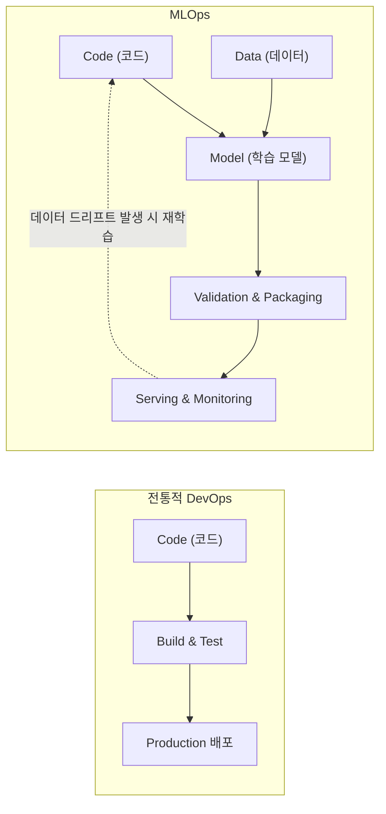
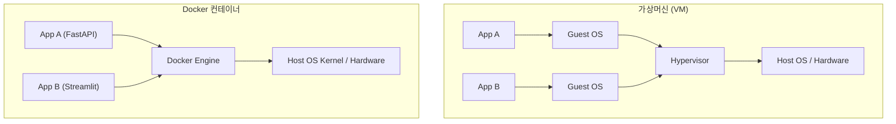

# Day 01: MLOps 소개 및 컨테이너 가상화 기초 이론

> **MLOps(Machine Learning Operations)**는 머신러닝 모델의 개발(Dev)부터 운영 및 배포(Ops)까지의 전 과정을 자동화하고 안정적으로 관리하기 위한 엔지니어링 방법론입니다.

---

## 📌 1일차 학습 교안
* 📖 **노드 1 교안**: [`../docs/노드1_MLOps 소개_1-5강.pdf`](../docs/노드1_MLOps%20소개_1-5강.pdf) (1~5강: MLOps 소개 및 라이프사이클)
* 📖 **노드 2 교안**: [`../docs/노드2_Docker_6-13강.pdf`](../docs/노드2_Docker_6-13강.pdf) (6~13강: Docker 가상화 기초 및 컨테이너 아키텍처)

---

## 💡 1. 왜 MLOps가 필요한가? (등장 배경)

### 1-1. 전통적 소프트웨어(DevOps) vs 머신러닝 시스템(MLOps)
전통적인 소프트웨어는 **코드(Code)**만 관리하면 되지만, 머신러닝 시스템은 **코드(Code) + 데이터(Data) + 모델(Model)** 3가지 요소가 상호 유기적으로 결합되어 지속적으로 변화합니다.



### 1-2. 머신러닝 시스템의 숨겨진 기술 부채 (Hidden Technical Debt)
* 데이터 사이언티스트가 로컬 노트북에서 작성하는 순수 ML 코드는 전체 시스템의 **5~10%**에 불과합니다.
* 나머지 90%는 데이터 수집/검증, 피처 추출, 인프라 서빙, 리소스 관리, 모니터링, 프로세스 관리 등 **엔지니어링 영역**입니다.
* MLOps는 이 90%의 복잡한 운영 인프라를 체계화하여 모델이 빠르게 실제 비즈니스 가치로 이어지도록 합니다.

---

## 🔄 2. 머신러닝 라이프사이클 (ML Lifecycle)

```mermaid
flowchart TD
    A["1. 비즈니스 문제 정의 & 목표 설정"] --> B["2. 데이터 수집, 정제 & EDA"]
    B --> C["3. 피처 엔지니어링 (Feature Engineering)"]
    C --> D["4. 모델 학습 & 하이퍼파라미터 튜닝"]
    D --> E["5. 모델 검증 & 직렬화 (Serialization)"]
    E --> F["6. 모델 컨테이너화 & API 서빙 배포"]
    F --> G["7. 실시간 성능 모니터링 (Drift 감지)"]
    G -.->|성능 저하 시 자동 재학습(CT)| D
```

1. **데이터 파이프라인 (Data Pipeline)**: 지속적으로 유입되는 데이터 수집, 이상치 정제, 검증
2. **학습 파이프라인 (Training Pipeline)**: 데이터 전처리, 모델 훈련, 검증 및 직렬화(`model.joblib`)
3. **배포 파이프라인 (Deployment Pipeline)**: REST API 서버 패키징(`FastAPI`), 컨테이너화(`Docker`), 클라우드 배포(`GCP`)
4. **운영 및 모니터링 (Ops & Monitoring)**: API 레이턴시, 요청 처리량, 데이터 드리프트(Data Drift) 및 모델 드리프트(Model Drift) 감지

---

## 🐳 3. 가상화 기술의 발전과 Docker의 핵심 원리

### 3-1. 가상머신(VM) vs Docker 컨테이너 비교

| 구분 | 가상머신 (Virtual Machine) | Docker 컨테이너 (Container) |
| :--- | :--- | :--- |
| **구동 방식** | 하이퍼바이저 위에 독립된 **Guest OS 전체**를 구동 | 호스트 OS의 **커널(Kernel)을 공유**하며 프로세스 격리 |
| **시작 속도** | 분(Minutes) 단위 (OS 부팅 필요) | **초(Seconds) 단위** (즉시 프로세스 실행) |
| **용량 및 자원** | 수 GB ~ 수십 GB, 자원 할당 무거움 | **수십 MB ~ 수백 MB**, 가볍고 효율적 |
| **격리 수준** | 완전한 하드웨어 레벨 격리 | OS 프로세스 레벨 격리 (cgroups, namespaces) |



### 3-2. Docker의 3대 핵심 요소
1. **Dockerfile**: 이미지를 만들기 위한 빌드 명세서 (레시피)
2. **Image (이미지)**: 애플리케이션 실행에 필요한 코드, 런타임, 라이브러리, 환경설정을 불변(Immutable) 상태로 묶어둔 템플릿
3. **Container (컨테이너)**: 이미지를 실행한 격리된 인스턴스 (실제 동작하는 프로세스)

---

## 🗺️ 4. 앞으로의 전체 실습 로드맵 연계

* **Day 01 (이론)**: MLOps 개념, 머신러닝 라이프사이클, 컨테이너 가상화 기초 이해
* **Day 02 (로컬 서빙)**: Scikit-learn 모델 학습 ➔ `joblib` 직렬화 ➔ `FastAPI` 로컬 서빙 API 구축
* **Day 03 (클라우드 배포)**: `Dockerfile` 작성 ➔ `Docker Hub` 푸시 ➔ `GCP Compute Engine` 클라우드 배포 ➔ `Streamlit` 연동
* **Day 04 (자동화)**: `GitHub Actions`를 이용한 CI/CD (코드 푸시 시 클라우드 자동 배포)
