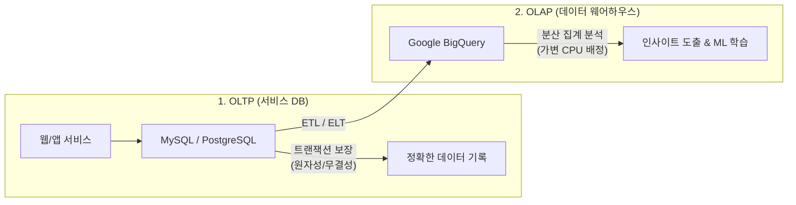
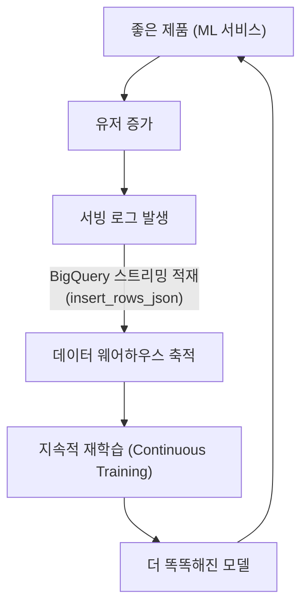

# Day 05: Google Cloud Platform & BigQuery 실시간 데이터 파이프라인

> **5일차 학습 범위**: 「모두를 위한 MLOps」 14강 ~ 16강  
> **핵심 목표**: 머신러닝 시스템의 기반이 되는 데이터 인프라를 이해하고, Google Cloud Platform(GCP)의 데이터 웨어하우스인 **BigQuery**를 활용하여 대용량 분산 집계 및 **실시간 스트리밍 적재 파이프라인**을 구축합니다.

---

## 📌 5일차 학습 교안 및 구성
* 📖 **14강**: Google Cloud Platform 소개 (GCP 프로젝트, DW, OLTP vs OLAP)
* 📖 **15강**: BigQuery 소개 및 조회 (BigQuery 아키텍처, Python SDK, DW vs Data Lake, ETL vs ELT)
* 📖 **16강**: BigQuery 실시간 처리 (스트리밍 적재, 콜드 스타트, 지속적 학습 CT 루프, 데이터 플라이휠)

---

## 💡 1. 왜 AI/ML 인프라로 GCP인가? (14강)

### 1-1. 클라우드 서비스 제공자(CSP) 비교
* **AWS**: 국내 점유율 1위, 일반 웹/백엔드 서비스 구축에 강점
* **Google Cloud Platform (GCP)**: AI/ML 및 빅데이터 분야의 서비스(BigQuery, Vertex AI 등)가 가장 강력하고 풍부함. 자사 제품군을 스스로 "AI 클라우드"로 정의할 만큼 MLOps 인프라 구축에 최적화

### 1-2. GCP의 핵심 관리 단위: 프로젝트(Project)
* AWS는 계정 단위로 자원이 묶이지만, GCP는 **프로젝트(Project)** 단위로 자원이 격리 관리됨.
* **과금 방지**: 학습용 프로젝트를 만들어 실습한 뒤, 프로젝트째 삭제하면 내부의 모든 자원이 일괄 정리되어 예상치 못한 과금을 원천 차단할 수 있음.
* 실제 SDK나 SQL에서 참조할 때는 숫자 번호가 아닌 **문자열 프로젝트 ID (`PROJECT_ID`)**를 사용.

---

## 🗄️ 2. OLTP vs OLAP 및 데이터 웨어하우스 (14~15강)



### 2-1. OLTP와 OLAP 비교

| 구분 | OLTP (Online Transaction Processing) | OLAP (Online Analytical Processing) |
| :--- | :--- | :--- |
| **주 용도** | 서비스 운영 데이터베이스 (회원가입, 결제 등) | 데이터 웨어하우스, 대규모 분석 및 ML 피처 가공 |
| **트랜잭션** | 원자성, 일관성, 무결성 보장 (실패 시 롤백) | 트랜잭션 미지원 (대신 초고속 분산 처리) |
| **강점** | 데이터 신뢰성, 즉각적인 단건 응답 | **수억~수조 건의 대규모 데이터 분산 집계 속도** |
| **대표 제품** | MySQL, PostgreSQL, MariaDB | **Google BigQuery**, Redshift, Snowflake |

### 2-2. ETL vs ELT (최신 트렌드와 ML의 관계)
* **ETL (Extract ➔ Transform ➔ Load)**: 적재 전에 데이터를 정제/변환하므로 원본 세부 데이터가 소실되어, 추후 ML에서 새로운 피처가 필요할 때 복구 불가.
* **ELT (Extract ➔ Load ➔ Transform)**: **일단 원본 그대로 무조건 저장(Load)**한 뒤 필요할 때 변환. 머신러닝 피처 보존 및 데이터 레이크에 최적화된 최신 트렌드.

---

## ⚡ 3. BigQuery 핵심 아키텍처 & Python SDK 연동 (15강)

* **서버리스 & 가변 CPU 할당**: 평소에는 연산 장치가 붙어있지 않은 저장소 상태이다가, 쿼리 요청 시 수백~수만 개의 CPU 슬롯이 동적으로 할당되어 **분할 정복(Divide & Conquer) + 리밸런싱**으로 초고속 처리.
* **복합 데이터 타입 지원**: `ARRAY`, `RECORD`, `ARRAY_AGG` 등을 지원하여 정형 SQL이면서도 JSON/NoSQL과 같은 유연한 비정형 구조 집계 가능.

### 🐍 Python SDK 연동 예제
```python
from google.cloud import bigquery
from google.colab import auth

# 1. 인증 및 클라이언트 생성
auth.authenticate_user()
PROJECT_ID = "본인-프로젝트-ID"
client = bigquery.Client(PROJECT_ID)

# 2. BigQuery 공개 데이터셋 쿼리 실행
query = """
SELECT repository.language, COUNT(*) as total_repos
FROM `bigquery-public-data.samples.github_nested`
WHERE repository.language IS NOT NULL
GROUP BY repository.language
ORDER BY total_repos DESC
LIMIT 10
"""
df = client.query(query).to_dataframe()
print(df.head())
```

---

## 🔄 4. BigQuery 실시간 스트리밍 적재 & MLOps 데이터 플라이휠 (16강)



### 4-1. 스트리밍 적재 (`insert_rows_json`)
* 파일을 모아서 올리는 배치(Batch) 방식과 달리, 1건씩 발생하는 로그를 즉시 밀어 넣는 실시간 적재 방식.
* 쓰는 작업(Python 앱)과 읽는 작업(BigQuery Studio 분석)이 서로 락(Lock)을 걸지 않고 독립적으로 동시 수행됨.

### 4-2. MLOps 관점의 핵심 개념
1. **콜드 스타트(Cold Start)**: 서비스 초기에는 학습 데이터가 없으므로 ➔ 규칙 기반(Rule-based) 코드로 먼저 출시 ➔ 서빙 로그 축적 ➔ 충분해진 데이터로 모델 학습 전환
2. **지속적 학습 (Continuous Training, CT)**: 실시간으로 유입되는 서빙 로그를 기반으로 모델 드리프트(Model Drift)를 방지하고 최신 트렌드를 반영하는 재학습 파이프라인 구현
3. **데이터 플라이휠(Data Flywheel)**: 제품 ➔ 유저 ➔ 데이터 ➔ 모델 ➔ 더 좋은 제품으로 이어지는 선순환 루프
