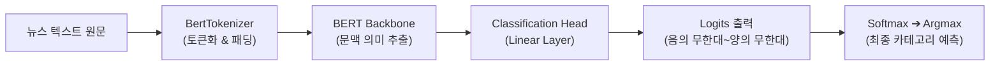
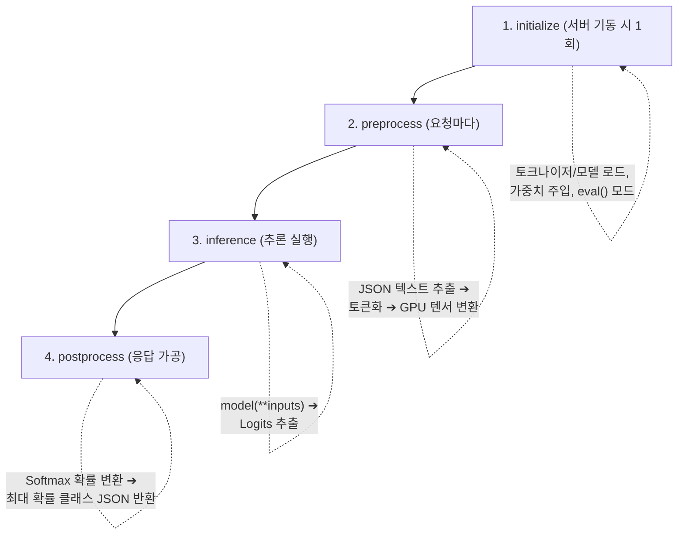
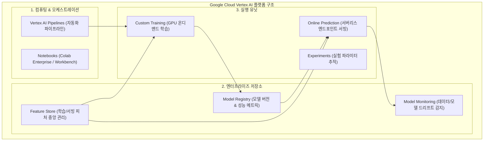

# Day 06: PyTorch BERT 파인튜닝, TorchServe 모델 서빙 & Vertex AI

> **6일차 학습 범위**: 「모두를 위한 MLOps」 17강 ~ 18강  
> **핵심 목표**: 자연어 처리(NLP) 사전학습 모델인 **BERT**를 AG News 데이터셋으로 파인튜닝하고, 가중치와 핸들러를 `.mar` 파일로 아카이빙하여 **TorchServe 기반 고성능 추론 서버**를 구축한 뒤, GCP의 엔터프라이즈 MLOps 플랫폼인 **Vertex AI의 전체 아키텍처**를 이해합니다.

---

## 📌 6일차 학습 자료 및 파일 매핑
* 📓 **실습 주피터 노트북**: [`3_PyTorch_model_serving.ipynb`](./3_PyTorch_model_serving.ipynb)
* 📖 **17강 교안**: 모델 학습 및 서빙 도입 (BERT 4분류, TorchServe `.mar` 패키징, 5000번 포트 추론, ngrok)
* 📖 **18강 교안**: Vertex AI 소개 (Model Registry, Feature Store, Training, Pipeline, Endpoints)

---

## 🌲 1. BERT 파인튜닝 & 텍스트 4분류 모델 학습 (17강)

### 1-1. 문제 정의 (AG News 4분류)
* `0: World (시사)`, `1: Sports (스포츠)`, `2: Business (경제)`, `3: Sci/Tech (기술·과학)`

### 1-2. 모델 및 학습 구성
* **토크나이저**: `BertTokenizer (bert-base-uncased)`
* **모델 아키텍처**: `BertForSequenceClassification (num_labels=4)`
* **옵티마이저 / 손실 함수**: `AdamW (lr=5e-5)` / `CrossEntropyLoss`
* **하드웨어 가속**: T4 GPU 환경에서 3 Epochs 학습 ➔ Test Accuracy **약 85~88%** 달성



---

## 📦 2. 왜 `.pth` 파일만으로는 서빙할 수 없는가? (모델 아카이빙)

* **문제점**: `torch.save(model.state_dict(), 'model.pth')` 파일은 모델의 순수 가중치(파라미터 숫자)만 담고 있습니다. 
* **해결책**: 실서비스 서빙을 위해서는 **[가중치(`.pth`) + 모델 아키텍처 + 토크나이저 전후처리 핸들러 + 설정 파일]**이 하나로 묶인 **`.mar` (Model Archive)** 파일이 필수적입니다.

### 🔄 TorchServe 핸들러 4단계 생명주기 (`model_handler.py`)


---

## 🚀 3. TorchServe 패키징 및 추론 서버 기동

### 3-1. 모델 아카이버 실행 (`.mar` 생성)
```bash
# 1. 아카이브 저장 폴더 생성
mkdir -p model-store

# 2. .mar 파일 패키징
torch-model-archiver \
  --model-name bert_news_classification \
  --version 1.0 \
  --serialized-file bert_news_classification_model.pth \
  --handler ./model_handler.py \
  --extra-files "bert-base-uncased-vocab.txt" \
  --export-path model-store \
  -f
```

### 3-2. TorchServe 서버 기동 및 헬스체크 (5000번 포트)
```bash
# 1. 백그라운드 서버 기동
torchserve --start --ncs --ts-config config.properties \
  --model-store model-store \
  --models bert_news_classification=bert_news_classification.mar \
  --disable-token-auth

# 2. 서버 정상 기동 확인 (헬스체크)
curl -X GET http://localhost:5000/ping
# 응답: {"status": "Healthy"}

# 3. 뉴스 기사 카테고리 예측 요청
curl -X POST -H "Accept: application/json" -T "request_sports.json" \
  http://localhost:5000/predictions/bert_news_classification
# 응답: [{"label": 1, "probability": 0.9878}] (Sports 판정)
```

---

## ☁️ 4. Vertex AI 소개 및 엔터프라이즈 MLOps 아키텍처 (18강)

> **Vertex AI란?**: 단일 도구가 아닌, 머신러닝 모델의 학습·평가·서빙·모니터링 전체 라이프사이클을 한곳에서 유기적으로 연결 관리하는 **Google Cloud의 통합 MLOps 플랫폼(공구 상자)**입니다.



### 4-1. 수동 노트북 파이프라인 vs Vertex AI 대응표

| 수동 파이프라인의 한계 | Vertex AI 대응 컴포넌트 | MLOps 엔지니어링 효과 |
| :--- | :--- | :--- |
| 학습이 개인 로컬 장비에 묶임 | **Vertex AI Training** | 필요할 때만 클라우드 GPU를 할당받아 학습하고 즉시 자원 반환 (비용 최적화) |
| 모델 가중치 파일이 로컬에 흩어짐 | **Model Registry** | 모델의 버전(v1, v2)과 성능 지표, 아티팩트를 중앙 저장소에서 체계적 추적 및 롤백 |
| 서빙 서버를 수동으로 띄움 | **Online Prediction** | 모델 등록 시 프로덕션 엔드포인트 URL이 자동 생성되며 오토스케일링 지원 |
| 데이터/피처가 여러 곳에 산재됨 | **Feature Store** | 서빙과 학습에서 일관된 피처를 재사용하고, 배포 후 데이터 드리프트를 실시간 감지 |
| 학습~배포 단계가 수동 실행임 | **Vertex AI Pipelines** | 데이터 수집부터 모델 배포까지의 전 과정을 하나의 자동화 파이프라인 코드로 오케스트레이션 |
